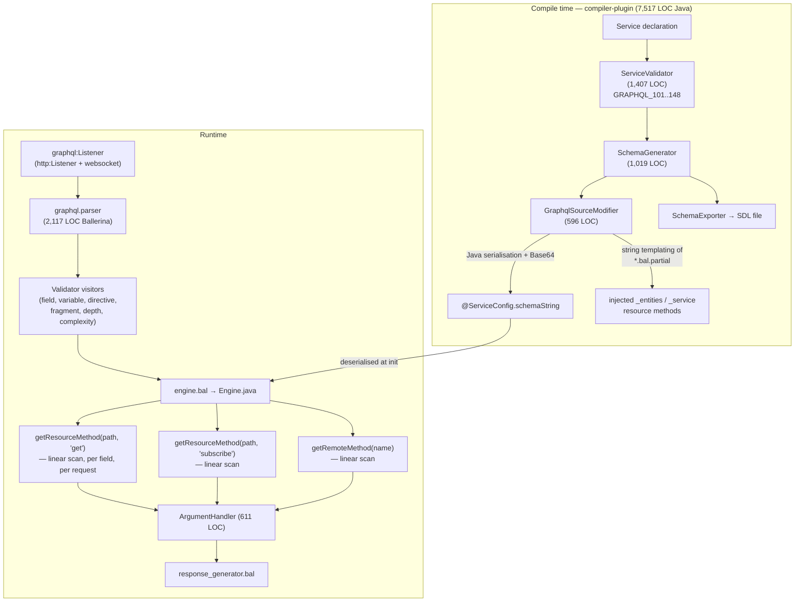
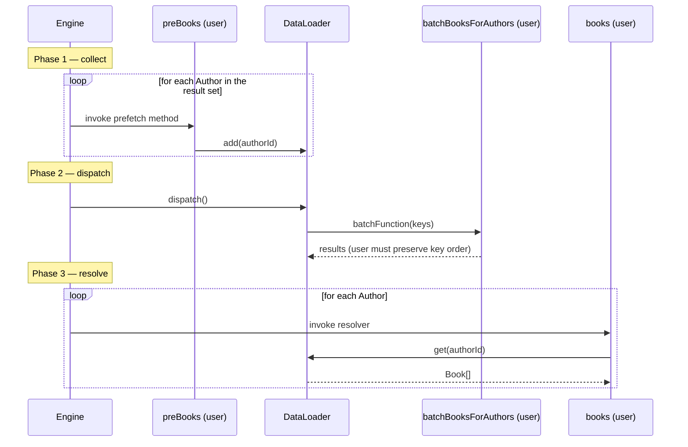
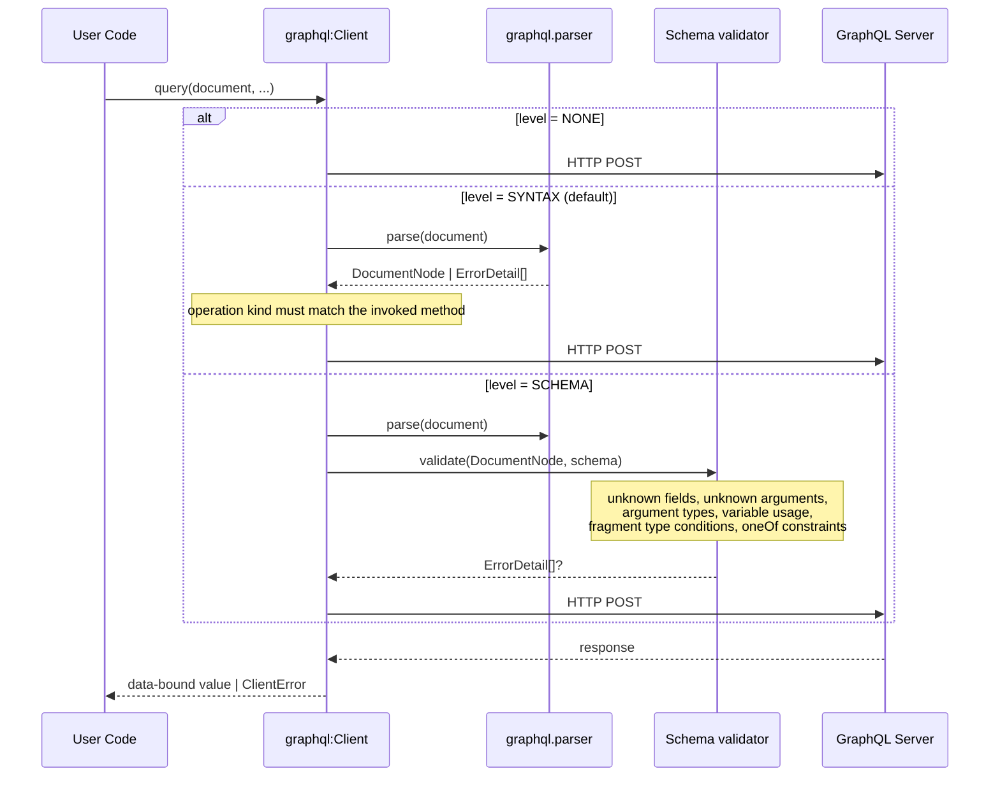

# Ballerina GraphQL Package Revamp

- Authors
  - Thisaru Guruge
- Reviewed by
  - _TBD_
- Created date
  - 2026-08-04
- Updated date
  - 2026-08-12
- Issue
  - [NNNN](https://github.com/ballerina-platform/ballerina-spec/issues/NNNN) <!-- PLACEHOLDER: replace NNNN with the real issue number once created. Highest existing BEP at time of writing is 1460. -->
- State
  - Submitted

## Summary

The Ballerina GraphQL package maps the three GraphQL operation types onto three structurally different constructs — a `query` field is a `resource function get`, a `mutation` field is a `remote function`, and a `subscription` field is a `resource function subscribe` — an asymmetry that is the single most frequent source of confusion for users coming from a GraphQL background. This proposal unifies all three onto one construct, the resource method, naming the operation type explicitly by the accessor (`query`, `mutate`, `subscribe`); how `get` and `remote` are retired is left open, with a major-version hard break and a dual-syntax deprecation window both developed in full and compared unbiased in [Section 1.4](#14-comparison-the-decision-this-proposal-does-not-make) for reviewers to decide. Alongside the resolver model, this proposal also overhauls the diagnostic-code convention, sets direction for Federation v2 parity, streamlines the data loader API, implements the `@oneOf` and argument/input-field `@deprecated` directives from the September 2025 edition of the GraphQL specification, and adds an opt-in schema-aware validation tier to the client introduced by [BEP 1460](https://github.com/ballerina-platform/ballerina-spec/issues/1460).

## Motivation

### The resolver model does not resemble GraphQL

A user writing a GraphQL service in Ballerina today must learn three unrelated Ballerina constructs to express the three GraphQL operation types, and none of the three names the operation type:

```ballerina
service on new graphql:Listener(9090) {

    // Query.greeting
    resource function get greeting(string name) returns string {
        return string `Hello, ${name}`;
    }

    // Mutation.updateName
    remote function updateName(string name) returns string {
        return name;
    }

    // Subscription.updates
    resource function subscribe updates(string topic) returns stream<string, error?> {
        return getUpdateStream(topic);
    }
}
```

Nothing in `resource function get greeting` says "query", and nothing in `remote function updateName` says "mutation". Developers have to learn the mapping, since it is unintuitive.

> **Note:** It's worth noting the following [ballerina-library discussion #757](https://github.com/ballerina-platform/ballerina-library/discussions/757).

- **`get` for queries** was chosen by analogy with the HTTP `GET` method, on the grounds that a GraphQL query is a read operation. HTTP methods are orthogonal to GraphQL operation types. The GraphQL over HTTP specification requires servers to accept `POST` for _all_ operation types and makes `GET` support optional ([GraphQL over HTTP, draft](https://graphql.github.io/graphql-over-http/draft/)); the Ballerina GraphQL listener itself accepts both. A `query` field is therefore served over `POST` in the common case, while being declared with the `get` accessor, which breaks the analogy anyway.
- **`remote` for mutations** was chosen on the grounds that mutating data is characteristically a remote interaction (a database write, a call to another service). This conflates the field's _semantics_ with its _implementation_: an in-memory mutation is still a `mutation` field, and a `query` field that hits a database is still a query. The construct also leaks an implementation detail into the schema-facing declaration, which is precisely the thing the code-first model is supposed to hide.

The asymmetry has concrete, measurable costs beyond readability:

- **`graphql:Upload` is only permitted in `remote` methods** (diagnostic `GRAPHQL_119` rejects it in resource methods). The restriction the package actually wants to express is "file upload is only meaningful on a mutation", but because mutations are the only remote methods, the rule is written against the wrong axis. This is a symptom of having different constructs.
- **Interceptors are declared with a `remote function execute`** (`graphql:Interceptor`), so `remote function` means two unrelated things inside the same package.
- The package must maintain two parallel dispatch paths in the runtime — `getResourceMethod(...)` keyed by accessor and `getRemoteMethod(...)` keyed by name — and two parallel validation paths in the compiler plugin, for what is one concept.

### No comparable library borrows HTTP vocabulary

Every widely-used GraphQL server library names the operation type explicitly, and none reuses HTTP method names:

| Library                        | Query                           | Mutation                           | Subscription                  |
| ------------------------------ | ------------------------------- | ---------------------------------- | ----------------------------- |
| Apollo Server / graphql-js     | `Query` key in the resolver map | `Mutation` key                     | `Subscription` key            |
| HotChocolate (.NET)            | `[QueryType]` / `Query` type    | `[MutationType]` / `Mutation` type | `[SubscriptionType]`          |
| Spring for GraphQL             | `@QueryMapping`                 | `@MutationMapping`                 | `@SubscriptionMapping`        |
| gqlgen (Go)                    | `QueryResolver`                 | `MutationResolver`                 | `SubscriptionResolver`        |
| graphql-go/graphql             | object named `Query`            | object named `Mutation`            | object named `Subscription`   |
| Strawberry / Graphene (Python) | `Query` class                   | `Mutation` class                   | `Subscription` class          |
| Ballerina                      | `resource function get`         | `remote function`                  | `resource function subscribe` |

Spring for GraphQL is the closest precedent: `@QueryMapping`, `@MutationMapping`, and `@SubscriptionMapping` are all meta-annotations over the same underlying `@SchemaMapping`, differing only in the preset `typeName` ([Spring for GraphQL — Annotated Controllers](https://docs.spring.io/spring-graphql/reference/controllers.html)). That is structurally identical to what this proposal does with resource accessors: one construct, three values, operation type named at the declaration site.

### Capability gaps

The package is a mature implementation of the October 2021 GraphQL specification with several Ballerina-specific strengths (compile-time schema generation, declarative auth, constraint validation, built-in complexity and depth limits, server-side and document caching). The remaining gaps are documented with exact present-day behaviour in [Current State Analysis](#current-state-analysis) and addressed in [Section 2](#2-federation-high-level-direction-only) through [Section 5](#5-client-side-schema-aware-validation).

### Low-code consumption

The WSO2 Integrator surfaces a `graphql:Client` as a connector. Because `execute()` is the only operation, the connector presents a single, semantically opaque action. [BEP 1460](https://github.com/ballerina-platform/ballerina-spec/issues/1460) resolves this by introducing `query()`, `mutate()`, and `subscribe()`. This proposal builds on that by making the client's optional schema the single artifact from which both runtime validation and design-time assistance can be derived.

## Goals

- Unify the three GraphQL operation types onto a single Ballerina construct — the resource method — with the operation type named explicitly by the accessor (`query`, `mutate`, `subscribe`), and decide, informed by [Section 1.4](#14-comparison-the-decision-this-proposal-does-not-make), how `get` and `remote` are retired.
- Re-express every compiler-plugin diagnostic that currently encodes the `resource`/`remote` split so that it constrains the correct axis (operation type), not an incidental one (method kind).
- Replace the compiler plugin's ad hoc, chronologically-assigned diagnostic codes with a documented, severity- and area-based convention that has headroom for years of future growth, as a non-breaking overhaul.
- Fix the runtime's per-request, per-field linear scan over every resource and remote method with a dispatch structure resolved once, reusing the compile-time knowledge the compiler plugin already has.
- Set the direction for Federation v2 parity — specifically, engine-native `_entities`/`_service` resolution — and hand the rest of the directive/validation/composition work to a dedicated child BEP rather than designing it here.
- Reduce data loader boilerplate: declarative loader registration, compile-time-checked loader references, and removal of the mandatory prefetch method for the common case.
- Implement the directives ratified in the September 2025 edition of the GraphQL specification that the package currently lacks or rejects: `@oneOf`, and `@deprecated` on arguments and input fields.
- Add an opt-in schema-aware client-side validation tier on top of the syntax-level validation introduced by BEP 1460.
- Establish the direction for user-definable custom scalars, the largest remaining type-system gap, without designing the full API in this proposal.

## Non-Goals

- **A decision between the two resolver-model approaches.** This proposal designs both the major-version break and the dual-syntax deprecation window in full and compares them unbiased in [Section 1.4](#14-comparison-the-decision-this-proposal-does-not-make); it does not pick one.
- **Federation v2 parity, designed in full.** Only engine-native `_entities`/`_service` resolution is committed here. The directive set, `FieldSet` validation, reference-resolver narrowing, static composition, and cross-module entities are out of scope for this proposal and belong in a dedicated child BEP — see [Section 2](#2-federation-high-level-direction-only).
- **The `bal graphql` tool.** Schema-first service generation and client generation are a separate effort. The tool must be updated to emit the new resolver forms; that work is tracked separately. Under the dual-syntax approach this is a soft dependency (old-form generated code still compiles); under the major-version approach it is a hard release dependency — see [Section 1.4](#14-comparison-the-decision-this-proposal-does-not-make).
- **User-definable custom directives.** A mechanism for users to declare and execute their own directives overlaps conceptually with the existing interceptor model and warrants its own BEP. This has been scoped before: [ballerina-library#3201](https://github.com/ballerina-platform/ballerina-library/issues/3201) (closed, a design subtask with no surviving detail) and, more substantively, [ballerina-library#4327](https://github.com/ballerina-platform/ballerina-library/issues/4327) (draft proposal for custom _executable_ directives). Both predate this proposal and may be out of date, but #4327 in particular is close enough to reviewable that it should be the starting point.
- **User-declarable `Query`/`Mutation`/`Subscription` root type names.** The engine infers these three root type names; a user cannot supply their own or attach type-level documentation to them, because there is no user-authored symbol that represents the root type itself. This is the same gap the service-typing proposal ([ballerina-library#4620](https://github.com/ballerina-platform/ballerina-library/issues/4620)) is aimed at solving more generally — see [Future Work](#future-work).
- **`@defer` / `@stream`.** Incremental delivery is at Stage 2 (experimental) in the GraphQL specification process and has no ratified response format ([graphql-spec #1018](https://github.com/graphql/graphql-spec/pull/1018), [graphql-js defer/stream docs](https://www.graphql-js.org/docs/defer-stream/)). Deferred to [Future Work](#future-work).
- **The full custom scalar API.** Direction only in this proposal; the API belongs in a child BEP. **General performance tuning.** With one deliberate exception — the compile-time-resolved dispatch table in [Section 1.2](#12-shared-compile-time-resolved-runtime-dispatch), fixed here because this proposal is already rewriting every dispatch call site regardless of which resolver-model approach is chosen — no other performance goals are set.
- **A full SSE subscription transport design.** BEP 1460 scopes the client to WebSocket only. This proposal does not restate or replace that scope, but does flag — because `ballerina/http` now supports server-sent events, including over HTTP/2 — that the client's HTTP/1.1 pin exists solely to support the WebSocket upgrade. See [Future Work](#future-work).

## Current State Analysis

This section records the present-day behaviour that [Design](#design) changes. Every claim is sourced from the package at `ballerina/graphql` v1.18.0 (distribution `2201.13.3`) and, where noted, the [Ballerina GraphQL Specification](https://github.com/ballerina-platform/module-ballerina-graphql/blob/master/docs/spec/spec.md).

> **Note on `GRAPHQL_nnn` codes.** Every diagnostic code cited in this document under its _current_ number (`GRAPHQL_101` and so on) is emitted by the GraphQL **compiler plugin** — an implementation detail of this package, not a Ballerina language error code. [Section 0](#0-diagnostic-code-convention) replaces every one of these numbers; this section keeps the current numbers because they're what's actually shipping today, and cross-references the new numbers where useful.

### Architecture



The three-way dispatch at the bottom of the runtime path (`RD1`/`RD2`/`RD3` in the diagram above) is the structural consequence of the current resolver model. The engine selects between them based on the document's operation type; the compiler plugin's service analysis walks resource and remote methods as two separate loops. Each of `RD1`/`RD2`/`RD3` is, today, a linear scan over every resource or remote method on the service, run again for every field of every request — see [Section 1.2](#12-shared-compile-time-resolved-runtime-dispatch) for the fix.

### Resolver model

| GraphQL root type | Ballerina form                                                |
| ----------------- | ------------------------------------------------------------- |
| `Query`           | `resource function get <path>(...)`                           |
| `Mutation`        | `remote function <name>(...)`                                 |
| `Subscription`    | `resource function subscribe <name>(...) returns stream<...>` |

Additional rules in force today:

- Non-root object fields (inside a `service class` or `distinct service object`) may use **only** the `get` accessor; `subscribe` is rejected there (`GRAPHQL_106`).
- At least one `get` resource is mandatory (`GRAPHQL_113`). The diagnostic message still refers to the `@dataloader:Loader` annotation, which does not exist in the shipped `graphql.dataloader` module.
- Only `get` and `subscribe` are accepted as root accessors (`GRAPHQL_126`).
- Hierarchical resource paths are supported for `get` and rejected for `subscribe` (`GRAPHQL_124`).
- A `service class` used as an object type may not contain `remote` methods (`GRAPHQL_101`).
- `graphql:Upload` is permitted only in `remote` methods (`GRAPHQL_119`).
- Mutations execute serially; queries execute in parallel. This is keyed off the _document's_ operation type, not off the method kind.

The accessor strings (`"get"`, `"subscribe"`) are hardcoded as literals independently in both the compiler plugin's validation logic and the runtime engine's dispatch logic, rather than centralized in one place — a small but telling symptom of the same underlying asymmetry.

### Diagnostic codes

Across the compiler plugin's diagnostic definitions, the package emits exactly **58** diagnostic codes today — 48 errors (`GRAPHQL_101`–`GRAPHQL_148`, contiguous, no gaps) and 10 warnings (`GRAPHQL_201`–`GRAPHQL_210`, contiguous). There is no `HINT`-severity diagnostic anywhere in the package, even though `io.ballerina.tools.diagnostics.DiagnosticSeverity` supports one. The numbering already happens to put errors in the 100s and warnings in the 200s, but this is an emergent pattern from chronological assignment, not a documented rule — nothing enforces it, and two codes already break it outright: `DiagnosticCode.WARNING_209` and `DiagnosticCode.WARNING_210` are named `WARNING_209`/ `WARNING_210` rather than `GRAPHQL_209`/`GRAPHQL_210`, inconsistent with every other constant in the same enum. Errors occupy 101–148 (48 of a 99-wide block before the next hundred), and codes are assigned in whatever order the feature that needed them landed — `GRAPHQL_133`–`138` (federation) sit between `GRAPHQL_128`/`129` (interceptors) and `GRAPHQL_139`/`140` (scalars/`@graphql:ID`) with no numeric grouping by topic, so the code number alone gives no hint what area of the package a diagnostic concerns. See [Section 0](#0-diagnostic-code-convention).

### Runtime dispatch performance

Every field resolution — for a `Query`/nested-object field, a `Mutation` field, and a `Subscription` field alike — is answered today by a linear scan over the service's full set of resource or remote methods, matched by accessor and path. Each of these scans is **re-run for every field, on every request** — the compiler plugin already knows the answer at compile time, but that information isn't carried into the runtime's method table. A separate scan, to look up the `@graphql:ResourceConfig` annotation for the same field, re-runs an equivalent search a second time — so a single field resolution can trigger a linear scan more than once. None of this is cached per listener; it's redone on every request.

The package already has the right piece of infrastructure to fix this without adding a new one: a single analysis pass already runs once per service, at listener-attach time, walking every resource and remote method exactly once and storing the result in a map keyed by schema coordinate (e.g. `"Query.greeting"`) as native data on the service object. Today, that map's entries carry only a complexity value — not a reference to the method itself. See [Section 1.2](#12-shared-compile-time-resolved-runtime-dispatch).

### Federation / subgraph

The subgraph module contains declarations only — no logic.

Supported Federation directives are **exactly two**: `@key` (on object and interface types, taking a `fields` selection and a `resolvable` flag) and `@link` (schema-level). The `@link` directive it emits already points at `https://specs.apollo.dev/federation/v2.0`, so the package is not stuck on the Federation v1 specification — what it lacks is coverage of the rest of the v2 directive set. The `_entities`/`_service` resolvers are injected as Ballerina source at compile time, generated from template files with placeholder substitution and parsed back in. Failure surfaces as `GRAPHQL_137`/`GRAPHQL_138`. Full design work addressing these limitations is deferred to a dedicated child BEP rather than designed here — see [Section 2](#2-federation-high-level-direction-only).

### Root type naming

`Query`, `Mutation`, and `Subscription` are not user-authored symbols anywhere in the package. The engine infers them from the service: the root object encountered at the service declaration becomes `Query`, its resource methods with a `mutate` accessor become `Mutation`, and so on. There is no equivalent of the `schema { query: MyQuery }` root-operation-type-alias construct that the GraphQL specification permits ([GraphQL specification — Type System, Schema](https://spec.graphql.org/September2025/#sec-Schema)). Two concrete consequences: a user cannot give the root types their own names, and a user cannot attach a type-level doc comment to `Query`, `Mutation`, or `Subscription`. This is a narrow gap in practice, and it is recorded here rather than assumed away. It is out of scope for this proposal; see [Non-Goals](#non-goals) and [Future Work](#future-work).

### Data loader

The entire `graphql.dataloader` module is small and minimal:

```ballerina
public type BatchLoadFunction isolated function (readonly & anydata[] keys) returns anydata[]|error;

public type DataLoader isolated object {
    public isolated function add(anydata key);
    public isolated function get(anydata key, typedesc<anydata> 'type = <>) returns 'type|error;
    public isolated function dispatch();
    public isolated function clearAll();
};
```

Per batched field, the user writes six things: a `contextInit` closure; one `registerDataLoader` call per loader; a string key repeated at every use site with no compile-time check; a prefetch method whose only job is to call `add`; the real resolver that calls `get`; and a batch function containing a manual `<readonly & int[]>` cast and manual key-to-result ordering. `Context.getDataLoader` **panics** if the key is absent. There is no `loadMany`, `prime`, or `clear(key)`.

This is a direct consequence of a Ballerina runtime limitation. A single-call loader API (`loader.load(key)` that suspends and resumes once a batch is ready) requires the engine to know when every resolver at the current selection-set level has requested a value and is now idle — the equivalent of what a JavaScript engine gets for free by observing an empty call stack at the end of an event-loop tick. The Ballerina runtime does not expose an analogous signal for strands. Any redesign of this module has to either accept that boilerplate as the price of correctness on this runtime, or make the case for new runtime capability that removes it (see [Section 3.3](#33-single-phase-load-spike-required-before-commitment)).



Two defects are worth recording because they must be fixed alongside any redesign:

1. **The specification's own examples contradict the implementation on the prefetch method's kind — a documentation deviation, not a functional defect.** The shipped mechanism works correctly and exactly as designed: a prefetch method must be a plain method, not a resource method. The defect is that three _other_ examples in the same document show `resource function get preBooks(...)` instead, which silently compiles into an unwanted `preBooks` field on `Query` rather than a working prefetch hook. See [Section 3.2](#32-fix-the-prefetch-method-contract).
2. **A pre-existing proposal document in the module repository describes a data-loader API that was never actually shipped** — an annotation-based configuration, a `load()` method (shipped instead as `add()`), and a `map<dataloader:DataLoader>`-shaped resolver parameter. This document is **not** touched by this proposal — see the note in [Migration Guide, Documentation](#documentation).

### Directives and type system

Supported directives: `@skip`, `@include` (executable), and `@deprecated` (type system).

Gaps against the [September 2025 edition of the GraphQL specification](https://spec.graphql.org/September2025/):

- **`@oneOf`** — ratified in the September 2025 edition ([announcement](https://graphql.org/blog/2025-09-08-september-edition/), [background](https://graphql.org/blog/2025-09-04-multioption-inputs-with-oneof/)). Not implemented. Related: the package rejects input unions other than `T|()` (`GRAPHQL_122`), and the specification records "Input Unions" as a known gap.
- **`@deprecated` on `ARGUMENT_DEFINITION` and `INPUT_FIELD_DEFINITION`** — also ratified in the September 2025 edition. The package _actively rejects_ this today with warning `GRAPHQL_201`.
- **`@specifiedBy`** — not implemented, and not implementable without custom scalars.

There is **no user-definable custom scalar mechanism**. `ScalarType` is a closed Java enum, and the usual workaround — aliasing a primitive — is explicitly rejected by `GRAPHQL_139`. `map<T>` and `json` are absent from both the return-type and input-type validator switches and therefore fall through to `GRAPHQL_102`; `table<T>` is supported on output only.

### Client

```ballerina
remote isolated function execute(string document, map<anydata>? variables = (),
        string? operationName = (), map<string|string[]>? headers = (),
        typedesc<GenericResponseWithErrors|record{}|json> targetType = <>)
        returns targetType|ClientError = @java:Method { ... } external;

@deprecated
remote isolated function executeWithType(...) returns targetType|ClientError = ... external;
```

No parsing or validation happens client-side; the document is sent as-is. `init` pins the underlying client to HTTP/1.1 — the pin exists because subscriptions (added by BEP 1460) go over a WebSocket upgrade, and Ballerina's WebSocket support requires HTTP/1.1. There is no subscription support in the shipped client today and no file-upload support.

BEP 1460 (now vendored into this repository at [GraphQL Client Subscription Support BEP](https://github.com/ballerina-platform/ballerina-spec/issues/1460), read in full for this revision — see [Section 5](#5-client-side-schema-aware-validation)) adds `query()`, `mutate()`, and `subscribe()`; deprecates `execute()` **without removing it** ("It remains functional throughout a deprecation period and will be removed in a later major version" — 1460's API Changes section); and removes the already-deprecated `executeWithType()` along with the `graphql:ServerError` type, which 1460 confirms is used only by `executeWithType()` and constructed nowhere else. This proposal does not restate 1460's design, but does rely on it directly in Section 5 and in the breaking-change accounting throughout this document.

### GraphQL over HTTP conformance

The listener accepts three request content types today — `application/json`, `application/graphql`, and `multipart/form-data` — and there is no handling of the `application/graphql-response+json` response media type and no `Accept` header negotiation. The GraphQL over HTTP specification is at Stage 2 (draft) and "may continue to evolve", so alignment is proposed as a discrete, separable item rather than as a conformance requirement.

### Blast radius, by approach

The blast radius of the resolver-model change is entirely different depending on which approach in [Section 1](#1-unified-resolver-model) is chosen. Under the major-version break, every existing `get`/`remote` declaration across the ecosystem must be rewritten. Under dual-syntax, existing declarations don't need to change at all — only new fixtures for the new forms and the deprecation warnings are added. See the comparison table in [Section 1.4](#14-comparison-the-decision-this-proposal-does-not-make) for the two blast radii side by side.

## Design

### Overview

| Part | Change                                                                                   | Breaking?                                                                      |
| ---- | ---------------------------------------------------------------------------------------- | ------------------------------------------------------------------------------ |
| 0    | [Diagnostic code convention](#0-diagnostic-code-convention)                              | No                                                                             |
| 1    | [Unified resolver model](#1-unified-resolver-model)                                      | **Depends on the approach chosen — see Section 1.4**                                  |
| 2    | [Federation — direction only](#2-federation-high-level-direction-only)                   | No (this proposal); TBD in the child BEP                                       |
| 3    | [Data loader streamlining](#3-data-loader-streamlining)                                  | Partly (`Context.getDataLoader` signature, Section 3.4)                               |
| 4    | [Directives ratified in the September 2025 edition](#4-directives-and-input-type-system) | Partly (`@deprecated` on a required argument, Section 4.2)                            |
| 5    | [Client-side schema-aware validation](#5-client-side-schema-aware-validation)            | No (this proposal's addition); BEP 1460 itself is breaking on its own timeline |

Part 1 is the only part with an open decision. Parts 0, 2 (the direction-only slice), 3, 4, and 5 are independent of that decision and of each other, but are bundled into one proposal because they touch the same declaration surface and reviewers should evaluate one coherent release, not five.

### 0. Diagnostic code convention

#### 0.1 What's wrong with the current scheme

[Current State Analysis, Diagnostic codes](#diagnostic-codes) establishes the facts: 58 codes, assigned chronologically, an accidental (undocumented) error/warning split at the hundreds digit that's already running low on room, no `HINT` severity despite the runtime supporting one, no topic grouping (a diagnostic's number gives no hint what area of the package it concerns), and an existing naming bug (`WARNING_209`/`WARNING_210` break the `GRAPHQL_nnn` naming convention every other constant follows). This proposal is already touching a large fraction of the diagnostic surface (every diagnostic in [Section 1](#1-unified-resolver-model), plus new ones in Section 2–Section 4) — the marginal cost of fixing the scheme itself, while already here, is small; fixing it later, once the numbering is even more heavily used, is not.

**This is not a breaking change.** A diagnostic code is compiler output — informational text (and, for tooling, a string identifier) emitted during `bal build`. No Ballerina program's source or binary compatibility depends on a specific diagnostic's number. The only real-world cost is that any external tooling matching on a specific code string (a CI lint rule suppressing a known warning, for instance) needs updating — worth a changelog line, not a version-compatibility concern.

#### 0.2 The new convention

```
GRAPHQL_<S><A><NN>
         │ │  └─ two-digit sequence within the area, in the order the diagnostic was introduced
         │ └──── one-digit area code (what part of the package)
         └────── one-digit severity (1 = ERROR, 2 = WARNING, 3 = HINT)
```

Area codes:

| Area    | Covers                                                                                                                                  |
| ------- | --------------------------------------------------------------------------------------------------------------------------------------- |
| `0`     | Core service & resolver structure — accessors, resource paths, listener wiring, service config                                          |
| `1`     | Type system — return/input types, unions, interfaces, `graphql:Upload`, `graphql:ID`, default values, scalars                           |
| `2`     | Federation / subgraph                                                                                                                   |
| `3`     | Data loader / prefetch methods                                                                                                          |
| `4`     | Interceptors                                                                                                                            |
| `5`     | Client (reserved — no compiler-plugin diagnostics exist here today; client-side errors are runtime types, not compile-time diagnostics) |
| `6`     | Directives & spec-edition extensions (`@oneOf`, `@deprecated` on arguments/input fields, and any future ratified-directive support)     |
| `7`–`8` | Reserved for areas not yet identified                                                                                                   |
| `9`     | General / misc (doesn't fit a specific area — e.g. schema-generation failure)                                                           |

Each area gets a full `01`–`99` sequence per severity — 100 codes per area per severity, 3,000 codes total across the scheme, against 58 in use today. This is deliberately generous: the point of a documented convention is to not need another overhaul the next time a feature area grows.

#### 0.3 Full mapping

Every code below is **proposed, not frozen** — final numbers are confirmed during implementation against whatever else has landed in the package by then.

<details>
<summary>See detailed error code examples:</summary>

##### Area 0 — Core service & resolver structure

| Current       | New            | Name                                                                                                                                            |
| ------------- | -------------- | ----------------------------------------------------------------------------------------------------------------------------------------------- |
| `GRAPHQL_101` | `GRAPHQL_1001` | `INVALID_FUNCTION` (remote method inside a `service class`)                                                                                     |
| `GRAPHQL_106` | `GRAPHQL_1002` | `INVALID_RESOURCE_FUNCTION_ACCESSOR` (nested accessor)                                                                                          |
| `GRAPHQL_107` | `GRAPHQL_1003` | `INVALID_MULTIPLE_LISTENERS`                                                                                                                    |
| `GRAPHQL_109` | `GRAPHQL_1004` | `INVALID_LISTENER_INIT`                                                                                                                         |
| `GRAPHQL_113` | `GRAPHQL_1005` | `MISSING_RESOURCE_FUNCTIONS`                                                                                                                    |
| `GRAPHQL_117` | `GRAPHQL_1006` | `INVALID_PATH_PARAMETERS`                                                                                                                       |
| `GRAPHQL_118` | `GRAPHQL_1007` | `INVALID_RESOURCE_PATH`                                                                                                                         |
| `GRAPHQL_124` | `GRAPHQL_1008` | `INVALID_HIERARCHICAL_RESOURCE_PATH`                                                                                                            |
| `GRAPHQL_125` | `GRAPHQL_1009` | `INVALID_SUBSCRIBE_RESOURCE_RETURN_TYPE`                                                                                                        |
| `GRAPHQL_126` | `GRAPHQL_1010` | `INVALID_ROOT_RESOURCE_ACCESSOR`                                                                                                                |
| `GRAPHQL_148` | `GRAPHQL_1011` | `INVALID_MODIFICATION_OF_SERVICE_CONFIG_FIELD`                                                                                                  |
| —             | `GRAPHQL_1012` | **New**, both approaches: `DUPLICATE_FIELD_DECLARATION` — see [Section 1.2](#12-shared-compile-time-resolved-runtime-dispatch)                         |
| —             | `GRAPHQL_1013` | **New, Approach A only**: `INVALID_REMOTE_METHOD` (remote forbidden entirely; subsumes `GRAPHQL_1001`'s root-level case)                        |
| —             | `GRAPHQL_2001` | **New, Approach B only**: `DEPRECATED_REMOTE_METHOD` (warning)                                                                                  |
| —             | `GRAPHQL_2002` | **New, Approach B only**: `DEPRECATED_GET_ACCESSOR` (warning, two message variants — see [Section 1.3](#13-approach-b-dual-syntax-deprecation-window)) |

##### Area 1 — Type system

| Current                                          | New            | Name                                                                                                                      |
| ------------------------------------------------ | -------------- | ------------------------------------------------------------------------------------------------------------------------- |
| `GRAPHQL_102`                                    | `GRAPHQL_1101` | `INVALID_RETURN_TYPE`                                                                                                     |
| `GRAPHQL_103`                                    | `GRAPHQL_1102` | `INVALID_INPUT_PARAMETER_TYPE`                                                                                            |
| `GRAPHQL_104`                                    | `GRAPHQL_1103` | `INVALID_RETURN_TYPE_NIL`                                                                                                 |
| `GRAPHQL_105`                                    | `GRAPHQL_1104` | `INVALID_RETURN_TYPE_ERROR_OR_NIL`                                                                                        |
| `GRAPHQL_108`                                    | `GRAPHQL_1105` | `INVALID_RETURN_TYPE_ERROR`                                                                                               |
| `GRAPHQL_110`                                    | `GRAPHQL_1106` | `INVALID_UNION_MEMBER_TYPE`                                                                                               |
| `GRAPHQL_111`                                    | `GRAPHQL_1107` | `INVALID_FIELD_NAME`                                                                                                      |
| `GRAPHQL_112`                                    | `GRAPHQL_1108` | `INVALID_RETURN_TYPE_ANY`                                                                                                 |
| `GRAPHQL_114`                                    | `GRAPHQL_1109` | `INVALID_RETURN_TYPE_INPUT_OBJECT`                                                                                        |
| `GRAPHQL_115`                                    | `GRAPHQL_1110` | `INVALID_RESOURCE_INPUT_OBJECT_PARAM`                                                                                     |
| `GRAPHQL_116`                                    | `GRAPHQL_1111` | `NON_DISTINCT_INTERFACE`                                                                                                  |
| `GRAPHQL_119`                                    | `GRAPHQL_1112` | `INVALID_FILE_UPLOAD_IN_RESOURCE_FUNCTION` (re-specified — see [Section 1.2](#12-shared-compile-time-resolved-runtime-dispatch)) |
| `GRAPHQL_120`                                    | `GRAPHQL_1113` | `MULTI_DIMENSIONAL_UPLOAD_ARRAY`                                                                                          |
| `GRAPHQL_121`                                    | `GRAPHQL_1114` | `INVALID_INPUT_TYPE`                                                                                                      |
| `GRAPHQL_122`                                    | `GRAPHQL_1115` | `INVALID_INPUT_TYPE_UNION`                                                                                                |
| `GRAPHQL_123`                                    | `GRAPHQL_1116` | `NON_DISTINCT_INTERFACE_IMPLEMENTATION`                                                                                   |
| `GRAPHQL_130`                                    | `GRAPHQL_1117` | `INVALID_ANONYMOUS_FIELD_TYPE`                                                                                            |
| `GRAPHQL_131`                                    | `GRAPHQL_1118` | `INVALID_ANONYMOUS_INPUT_TYPE`                                                                                            |
| `GRAPHQL_132`                                    | `GRAPHQL_1119` | `INVALID_RETURN_TYPE_CLASS`                                                                                               |
| `GRAPHQL_139`                                    | `GRAPHQL_1120` | `UNSUPPORTED_TYPE_ALIAS`                                                                                                  |
| `GRAPHQL_140`                                    | `GRAPHQL_1121` | `INVALID_USE_OF_ID_ANNOTATION`                                                                                            |
| `GRAPHQL_146`                                    | `GRAPHQL_1122` | `INVALID_EMPTY_RECORD_OBJECT_TYPE`                                                                                        |
| `GRAPHQL_147`                                    | `GRAPHQL_1123` | `INVALID_EMPTY_RECORD_INPUT_TYPE`                                                                                         |
| `GRAPHQL_205`                                    | `GRAPHQL_2101` | `UNABLE_TO_INFER_DEFAULT_VALUE_AT_COMPILE_TIME`                                                                           |
| `GRAPHQL_206`                                    | `GRAPHQL_2102` | `...PROVIDE_KEY_VALUE_PAIR`                                                                                               |
| `GRAPHQL_207`                                    | `GRAPHQL_2103` | `...PROVIDE_LITERAL_OR_CONSTRUCTOR_EXPRESSION`                                                                            |
| `GRAPHQL_208`                                    | `GRAPHQL_2104` | `...AVOID_USING_SPREAD_OPERATION`                                                                                         |
| `GRAPHQL_209` (currently misnamed `WARNING_209`) | `GRAPHQL_2105` | `UNABLE_TO_VALIDATE_DEFAULT_VALUES_OF_INPUT_FIELD`                                                                        |
| `GRAPHQL_210` (currently misnamed `WARNING_210`) | `GRAPHQL_2106` | `UNABLE_TO_VALIDATE_DEFAULT_VALUES_OF_INPUT_OBJECT`                                                                       |

##### Area 2 — Federation / subgraph

| Current       | New            | Name                                                                                                                                   |
| ------------- | -------------- | -------------------------------------------------------------------------------------------------------------------------------------- |
| `GRAPHQL_133` | `GRAPHQL_1201` | `INVALID_USE_OF_RESERVED_REMOTE_METHOD_NAME`                                                                                           |
| `GRAPHQL_134` | `GRAPHQL_1202` | `INVALID_USE_OF_RESERVED_RESOURCE_PATH`                                                                                                |
| `GRAPHQL_135` | `GRAPHQL_1203` | `INVALID_USE_OF_RESERVED_TYPE_AS_OUTPUT_TYPE`                                                                                          |
| `GRAPHQL_136` | `GRAPHQL_1204` | `INVALID_USE_OF_RESERVED_TYPE_AS_INPUT_TYPE`                                                                                           |
| `GRAPHQL_137` | `GRAPHQL_1205` | `FAILED_TO_ADD_ENTITY_RESOLVER` — **removed on delivery** of engine-native `_entities` ([Section 2](#2-federation-high-level-direction-only)) |
| `GRAPHQL_138` | `GRAPHQL_1206` | `FAILED_TO_ADD_SERVICE_RESOLVER` — **removed on delivery**, same reason                                                                |
| `GRAPHQL_203` | `GRAPHQL_2201` | `PROVIDE_KEY_VALUE_PAIR_FOR_ENTITY_ANNOTATION`                                                                                         |
| `GRAPHQL_204` | `GRAPHQL_2202` | `PROVIDE_A_STRING_LITERAL_OR_AN_ARRAY_OF_STRING_LITERALS_FOR_KEY_FIELD`                                                                |

> **Note:** `GRAPHQL_1207`+ and `GRAPHQL_2203`+ are reserved for the federation child BEP.

##### Area 3 — Data loader / prefetch

| Current       | New            | Name                                                                                                                                             |
| ------------- | -------------- | ------------------------------------------------------------------------------------------------------------------------------------------------ |
| `GRAPHQL_141` | `GRAPHQL_1301` | `MISSING_GRAPHQL_CONTEXT_PARAMETER`                                                                                                              |
| `GRAPHQL_142` | `GRAPHQL_1302` | `INVALID_PARAMETER_IN_PREFETCH_METHOD`                                                                                                           |
| `GRAPHQL_143` | `GRAPHQL_1303` | `INVALID_RETURN_TYPE_IN_PREFETCH_METHOD`                                                                                                         |
| `GRAPHQL_144` | `GRAPHQL_1304` | `UNABLE_TO_FIND_PREFETCH_METHOD`                                                                                                                 |
| `GRAPHQL_145` | `GRAPHQL_1305` | `INVALID_USAGE_OF_PREFETCH_METHOD_NAME_CONFIG` (message re-worded — [Section 3.2](#32-fix-the-prefetch-method-contract))                                |
| —             | `GRAPHQL_1306` | **New**: `UNDECLARED_DATA_LOADER` (was informally sketched as "`GRAPHQL_150`" in an earlier draft) — [Section 3.3](#33-declarative-loader-registration) |
| `GRAPHQL_202` | `GRAPHQL_2301` | `UNABLE_TO_VALIDATE_PREFETCH_METHOD`                                                                                                             |

##### Area 4 — Interceptors

| Current       | New            | Name                                       |
| ------------- | -------------- | ------------------------------------------ |
| `GRAPHQL_128` | `GRAPHQL_1401` | `RESOURCE_METHOD_INSIDE_INTERCEPTOR`       |
| `GRAPHQL_129` | `GRAPHQL_1402` | `INVALID_REMOTE_METHOD_INSIDE_INTERCEPTOR` |

##### Area 6 — Directives & spec-edition extensions

| Current       | New            | Name                                                                                                                                                    |
| ------------- | -------------- | ------------------------------------------------------------------------------------------------------------------------------------------------------- |
| `GRAPHQL_201` | `GRAPHQL_2601` | `UNSUPPORTED_INPUT_FIELD_DEPRECATION` — **removed on delivery** of `@deprecated` on input fields ([Section 4.2](#42-deprecated-on-arguments-and-input-fields)) |
| —             | `GRAPHQL_1601` | **New**: `INVALID_ONEOF_FIELD` ([Section 4.1](#41-oneof))                                                                                                      |
| —             | `GRAPHQL_1602` | **New**: `INVALID_REQUIRED_DEPRECATED_INPUT` ([Section 4.2](#42-deprecated-on-arguments-and-input-fields))                                                     |

##### Area 9 — General

| Current       | New            | Name                       |
| ------------- | -------------- | -------------------------- |
| `GRAPHQL_127` | `GRAPHQL_1901` | `SCHEMA_GENERATION_FAILED` |

This accounts for all 58 current codes plus every new one this proposal introduces (13, of which 2 are mutually exclusive by approach). The `WARNING_209`/`WARNING_210` naming bug is fixed as a side effect — every constant in the regenerated `DiagnosticCode` enum follows the same `GRAPHQL_nnnn` pattern.
</details>

### 1. Unified resolver model

#### 1.1 Shared: the three accessors

Both approaches in this section agree on the destination — what the _new_, recommended forms look like — and differ only in what happens to `get` and `remote`.

```ballerina
service on new graphql:Listener(9090) {

    // Query.greeting
    resource function query greeting(string name) returns string {
        return string `Hello, ${name}`;
    }

    // Mutation.updateName
    resource function mutate updateName(string name) returns string {
        return name;
    }

    // Subscription.updates
    resource function subscribe updates(string topic) returns stream<string, error?> {
        return getUpdateStream(topic);
    }
}
```

| GraphQL keyword | Accessor    | Form                        |
| --------------- | ----------- | --------------------------- |
| `query`         | `query`     | noun and verb are identical |
| `mutation`      | `mutate`    | verb form                   |
| `subscription`  | `subscribe` | verb form (already shipped) |

Accessors are verbs in Ballerina by convention (`get`, `post`, `put` in `ballerina/http`), and a resource accessor is grammatically an _identifier_ — `resource-method-name := identifier` ([Ballerina language specification, Resources](https://ballerina.io/spec/lang/master/#resources_defn)) — so all three names are legal without any language change. GraphQL engine uses its own runtime resource-method lookup, validated entirely by its compiler plugin.

`resource function mutate updateName` reads, on first encounter, like it says "mutate updateName" as an instruction rather than naming an operation (This was also a reason to use `remote` functions for mutations). The resolution: the accessor describes **what the client does**, not what the method does — a client _queries_ `greeting`, _mutates_ via `updateName`, and _subscribes_ to `updates`, exactly the pattern the already-shipped `resource function subscribe updates` establishes. Alternatives considered — including the noun `mutation` — are in [Alternatives](#mutation-as-the-accessor-instead-of-mutate).

Nested object fields (`service class`, `distinct service object`) use `query`:

```ballerina
distinct service class Author {
    resource function query name() returns string { ... }
    resource function query books() returns Book[] { ... }
}
```

`mutate` and `subscribe` remain invalid on non-root object types under both approaches — the GraphQL specification places mutation and subscription root fields only on the `Mutation` and `Subscription` types, so a nested `mutate` field has no schema representation.

#### 1.2 Shared: compile-time-resolved runtime dispatch

This applies identically to both approaches and is what removes the specific technical objection an earlier draft of this proposal raised against supporting two accessor spellings at once (see [Alternatives](#dual-accessor-support-during-a-deprecation-window)): **the runtime dispatch fix makes the number of accessor spellings a field can have irrelevant to dispatch cost.**

**The problem, precisely** ([Current State Analysis](#runtime-dispatch-performance)): the runtime resolves every `Query`/nested-object field, every `Mutation` field, and every `Subscription` field by linearly scanning the service's full set of resource and remote methods — on every single field resolution, on every request. The compiler plugin already knows, per declared path, exactly which method serves which field; that knowledge is discarded once compilation finishes.

**The fix reuses an existing compile-time analysis pass rather than adding a new one.** The compiler plugin already walks every resource and remote method exactly once, at listener-attach time, building a map keyed by schema coordinate and attaching it to the service as compiled-in data. Today that map's entries carry only a complexity value; this proposal extends each entry to also carry a reference to the method that resolves it, so that:

- Every per-request dispatch lookup in the runtime — for a query/nested-object field, a mutation field, a subscription field, and the field's `@graphql:ResourceConfig` — becomes a single map lookup keyed by schema coordinate, instead of a linear scan, regardless of which accessor spelling produced that coordinate at compile time.
- Building the map is also the natural place to enforce the one new cross-cutting rule both approaches need: **two declarations that resolve to the same schema coordinate is a compile error.** Once a service can (under Approach B) or, transiently during a migration, mixed-up code under either approach could declare `resource function get profile()` and `resource function query profile()` on the same type, this is where a **new compile-time check** (`GRAPHQL_1012`, `DUPLICATE_FIELD_DECLARATION`) belongs: the compiler plugin collects query-type fields (from `get`- and `query`-accessor resource methods together) and mutation-type fields (from `remote` methods and `mutate`-accessor resource methods together) into one namespace per operation type, and rejects a name collision within a namespace — the language does not do this for us, since a `remote function updateName` and a `resource function mutate updateName` are, to the language, two unrelated declarations that happen to share a name.
- `graphql:Upload`'s permitted-accessor check (`GRAPHQL_1112`) is re-specified against the same map: legal in the method bound to any `Mutation`-type coordinate (`remote` or `mutate`), illegal in the method bound to any `Query`- or `Subscription`-type coordinate (`get`, `query`, or `subscribe`) — one rule, expressed once, against the operation type rather than the method kind.

**Why this belongs in this proposal regardless of which resolver-model approach ships:** the fix is a strict improvement to today's already-shipped `get`/`remote`/`subscribe` dispatch, independent of whether a second spelling is ever added. This proposal already touches every dispatch call site in the runtime (Approach A rewrites them to remove a branch; Approach B rewrites them to add one) — doing the dispatch-table fix in the same pass costs little extra and is what makes Approach B's "does dual dispatch cost more on the hot path" question moot rather than merely asserted-away.

#### 1.3 The open decision

Two approaches were developed in full for what happens to `get` and `remote`. Reviewers choose one; nothing else in this proposal depends on which.

##### Approach A — Major version, hard break

`get` and `remote` are removed outright, in a release where breaking changes are permitted, with a major version bump and a required migration tool. There is no release in which both old and new forms compile.

**Diagnostics** (using the new numbering from [Section 0](#0-diagnostic-code-convention)):

- `GRAPHQL_1001` (`service class` contains a `remote` method) is **removed**, subsumed by the new `GRAPHQL_1013` (`INVALID_REMOTE_METHOD`: `remote methods are not allowed in a GraphQL service; use a "mutate" resource method for a GraphQL mutation field`), which fires unconditionally — a `remote` method anywhere on a GraphQL service, root or nested, is now invalid.
- `GRAPHQL_1002` (nested accessor): re-worded to "must be `query`" — `get` is no longer accepted anywhere. `GRAPHQL_1005` (`MISSING_RESOURCE_FUNCTIONS`): re-worded to "no `query` resource"; the stale `@dataloader:Loader` reference in the message is removed.
- `GRAPHQL_1008` (hierarchical paths): rejection set becomes **all three accessors** — `query`, `mutate`, `subscribe` alike. Hierarchical resource paths are removed entirely, not merely rejected on one accessor. Two independent reasons converge: for `mutate`, the GraphQL specification guarantees serial execution only for top-level mutation fields — a hierarchical `mutate` path would synthesise intermediate types whose fields execute in parallel, silently violating that guarantee. For `query`, hierarchical paths give up real capability (no `graphql:ResourceConfig` on an intermediate segment, no reusable intermediate type, no arguments at an intermediate level) that the equivalent nested `service class` form has for free, in exchange for a second, structurally different way to reach the same schema shape — and the two long-standing TODOs in the result-assembly path that exist purely to support hierarchical paths are deleted outright, not worked around further.
- `GRAPHQL_1010` (root accessor set): becomes `{query, mutate, subscribe}`.
- `GRAPHQL_1112` (`Upload`): permitted set becomes `{mutate}` only.
- `GRAPHQL_1201` (reserved `remote` method name): folded into `GRAPHQL_1202` (reserved resource path), since there's no longer a `remote` method namespace to protect separately.
- `GRAPHQL_2601` (`@deprecated` on input fields, unsupported): removed once `@oneOf`/`@deprecated` ship (Part 4, unaffected by which approach is chosen here).

**Migration.** Fully mechanical for the accessor rename (`get`→`query`, `remote function`→`resource function mutate`); a restructuring decision, not a rename, for hierarchical paths (must become nested `service class` types). A migration tool — `bal graphql migrate` or a documented mechanical recipe as a fallback — **must ship in the same release**; without it, this is a tax on every user rather than a one-command upgrade. `bal graphql` tool, WSO2 Integrator, Ballerina by Example, and VS Code templates all become hard release dependencies: any of them still emitting `get`/`remote` produces code that doesn't compile.

##### Approach B — Dual-syntax deprecation window

`get` and `remote` continue to work, unmodified in behaviour, for as long as this approach remains in effect. Each now triggers a compiler-plugin **warning** (never an error), naming no removal version. A service may mix `get`/`remote` and `query`/`mutate` field by field — this is the intended migration path, not an edge case to tolerate.

**Diagnostics:**

- `GRAPHQL_1001`, `GRAPHQL_1201` (both `remote`-related) are **unchanged** — `remote` methods still exist, so the rules about where they're allowed and what names are reserved still apply exactly as today.
- `GRAPHQL_1002` (nested accessor): both `query` and `get` are valid; using `get` here also triggers `GRAPHQL_2002`.
- `GRAPHQL_1005` (`MISSING_RESOURCE_FUNCTIONS`): the **check condition**, not just the message, changes — it must fire only when there is _no_ `get` **and** no `query` resource. A service written entirely with `get` is completely valid and must not trip this diagnostic.
- `GRAPHQL_1008` (hierarchical paths): rejection set gains `query` alongside the existing `subscribe` — `get` is **not** added to the rejection set; it keeps accepting hierarchical paths exactly as today. `mutate` never had a path concept to begin with (mutations weren't resource methods before), so there's nothing to reject there.
- `GRAPHQL_1010` (root accessor set): becomes `{get, query, mutate, subscribe}` (`remote` continues to be validated on a separate axis, as today, not through this accessor check).
- `GRAPHQL_1112` (`Upload`): permitted set becomes `{remote, mutate}`, both allowed.
- `GRAPHQL_1305` (prefetch-method-name config message): names all four resolver forms.
- **New**: `GRAPHQL_2001` (`DEPRECATED_REMOTE_METHOD`, warning) — fires on any `remote function` on a GraphQL service: `remote methods for GraphQL mutations are deprecated and will not be supported in a future release; use a "mutate" resource method instead`.
- **New**: `GRAPHQL_2002` (`DEPRECATED_GET_ACCESSOR`, warning) — fires on any `resource function get` (root or nested), in **two message variants**, because a user relying on a hierarchical path cannot simply rename to `query` and a shared message would give them wrong advice:
  - Plain (single-segment path): `the "get" accessor for GraphQL query fields is deprecated and will not be supported in a future release; use "query" instead`.
  - Hierarchical (multi-segment path): `the "get" accessor is deprecated; hierarchical resource paths are only supported under "get" and have no direct "query" equivalent — migrating requires restructuring into nested service classes`.

**No removal version is set by this proposal.** This is deliberate, matching the phrasing this approach was specified with, but it is also the approach's central risk — see [Section 1.4](#14-comparison-the-decision-this-proposal-does-not-make) and [Risks](#risks). "Deprecated" without a tracked target tends to become permanent in practice.

**Migration.** Optional, at the user's pace. The mechanical before/after table from Approach A applies identically as _guidance_, not as a forced step; hierarchical-path services have no forced decision at all — `get` keeps working for them indefinitely, whether or not they ever restructure.

**A migration tool is not required for this release** — nothing is forced to migrate, so there is no release-blocking need for one. It remains valuable and should be scoped and built ahead of whichever future release eventually removes `get`/`remote`, tracked as [Future Work](#future-work), not as a dependency of this proposal. `bal graphql` tool, WSO2 Integrator, Ballerina by Example, and VS Code templates should start emitting the new forms, but a lag is a quality gap, not a compile failure — old-form generated code keeps compiling.

#### 1.4 Comparison: the decision this proposal does not make

Both approaches solve the same problem — the resolver-model asymmetry described in [Motivation](#the-resolver-model-does-not-resemble-graphql) — but trade risk for a different shape.
Presented unbiased; the choice is for the reviewers.

| Dimension                                                                           | Approach A — Major version, hard break                                                                                                                                                                                                                                                                                                                                                                                                                                                                                                                                                                                                                                                                                                                                                                                                                                                                                                        | Approach B — Dual-syntax deprecation window                                                                                                                                                                                                                                                                                                                                                                                                                     |
| ----------------------------------------------------------------------------------- | --------------------------------------------------------------------------------------------------------------------------------------------------------------------------------------------------------------------------------------------------------------------------------------------------------------------------------------------------------------------------------------------------------------------------------------------------------------------------------------------------------------------------------------------------------------------------------------------------------------------------------------------------------------------------------------------------------------------------------------------------------------------------------------------------------------------------------------------------------------------------------------------------------------------------------------------- | --------------------------------------------------------------------------------------------------------------------------------------------------------------------------------------------------------------------------------------------------------------------------------------------------------------------------------------------------------------------------------------------------------------------------------------------------------------- |
| **Migration cost, this release**                                                    | High and mandatory: every existing GraphQL service must be edited to compile. Mitigated only by a migration tool that does not yet exist.                                                                                                                                                                                                                                                                                                                                                                                                                                                                                                                                                                                                                                                                                                                                                                                                     | Zero and optional: nothing that compiles today stops compiling.                                                                                                                                                                                                                                                                                                                                                                                                 |
| **Test/fixture churn, this release**                                                | The full existing test, fixture, example, and specification is rewritten to match the new functionality. This has a risk of missing regression. Although the existing integration test suite covers the most functionality.                                                                                                                                                                                                                                                                                                                                                                                                                                                                                                                                                                                                                                                                                                                   | None of the existing test, fixture, or examples changes. New coverage only: `query`/`mutate` fixtures, deprecation-warning fixtures, mixed-form fixtures.                                                                                                                                                                                                                                                                                                       |
| **Runtime/compiler-plugin complexity, ongoing**                                     | Simplifies over time: one accessor set, one dispatch path, one validation path — the state today's package is in, minus the asymmetry.                                                                                                                                                                                                                                                                                                                                                                                                                                                                                                                                                                                                                                                                                                                                                                                                        | A standing cost with no fixed end date: both `get`/`remote` and `query`/`mutate` are supported indefinitely, until a future release removes the old forms. Mitigated, not eliminated, by [Section 1.2](#12-shared-compile-time-resolved-runtime-dispatch)'s dispatch table, which makes the _performance_ cost of dual support a non-issue — it does not make the _design surface_ (two validation paths, two sets of fixtures, one more diagnostic family) disappear. |
| **Hierarchical resource paths**                                                     | Removed entirely, for all three accessors. Closes the two long-standing result-assembly TODOs tied to hierarchical paths outright.                                                                                                                                                                                                                                                                                                                                                                                                                                                                                                                                                                                                                                                                                                                                                                                                            | Removed only from the _new_ accessor (`query`); `get` keeps them exactly as today, open-ended. The TODOs stay live for as long as `get` is supported.                                                                                                                                                                                                                                                                                                           |
| **AI-assistant regeneration risk**                                                  | Low: a wrong (old-form) suggestion fails to compile immediately. The strongest available backstop against assistants trained on the old pattern regenerating it.                                                                                                                                                                                                                                                                                                                                                                                                                                                                                                                                                                                                                                                                                                                                                                              | Medium and _increased_ relative to doing nothing: a wrong suggestion compiles silently, with only a warning easy to miss in CI noise, for the entire deprecation window. Mitigated by refreshing `examples/`, the spec, and Ballerina by Example promptly (more urgent under this approach, not less), and possibly by letting teams promote these specific warnings to build failures internally (see [Risks](#risks)).                                        |
| **Risk of an indefinite half-migrated state**                                       | None — there is no state in which both forms exist.                                                                                                                                                                                                                                                                                                                                                                                                                                                                                                                                                                                                                                                                                                                                                                                                                                                                                           | The central risk of this approach: without a committed removal version, `get`/`remote` can persist as permanent, "deprecated-in-name-only" fixtures, and the original motivation (killing the asymmetry for newcomers) never fully lands, since tutorials/StackOverflow/AI training data continue to teach the old form for years.                                                                                                                              |
| **`bal graphql` tool / WSO2 Integrator / Ballerina by Example / VS Code templates** | Hard release dependency: any of them still emitting old forms produces code that fails to compile. Must be coordinated and released together.                                                                                                                                                                                                                                                                                                                                                                                                                                                                                                                                                                                                                                                                                                                                                                                                 | Soft dependency: lagging tooling produces code that still compiles, just doesn't demonstrate the recommended form. Coordination is a quality goal, not a release gate.                                                                                                                                                                                                                                                                                          |
| **Ecosystem/version-resolution consideration**                                      | A user pinned to the old major version in their own `Dependencies.toml` continues to work indefinitely on that version; new projects start on the new one. Ballerina's package resolution does not permit two different major versions of the _same_ package to be used simultaneously within one project's dependency graph. For some foundational packages (e.g. `ballerina/io`, `ballerina/http`, which many other connectors depend on transitively) this makes a hard break costly, because one project can get stuck between two transitive dependents that require different majors. For `ballerina/graphql` specifically, this risk is narrow: no other Ballerina Central packages or connectors are known to depend on `graphql` transitively (unlike `http`), so the conflict mainly arises only if a _user_ has published their own reusable library on top of `graphql` v1 that other users also import — a real but narrow case. | Not applicable in the same way — there is only ever one major version in play, because nothing is removed.                                                                                                                                                                                                                                                                                                                                                      |
| **What ships fastest**                                                              | Gated on a migration tool that doesn't exist yet — the single largest schedule risk.                                                                                                                                                                                                                                                                                                                                                                                                                                                                                                                                                                                                                                                                                                                                                                                                                                                          | Ships as soon as the compiler plugin/runtime changes land — no external tooling dependency gates the release.                                                                                                                                                                                                                                                                                                                                                   |
| **Second migration risk**                                                           | None — one migration, done.                                                                                                                                                                                                                                                                                                                                                                                                                                                                                                                                                                                                                                                                                                                                                                                                                                                                                                                   | If `get`/`remote` are eventually removed in a later major version, users who adopted `query`/`mutate` early pay nothing further, but users who never migrated face the same mandatory migration Approach A would have required now, just deferred and — if the "indefinite" risk above materializes — indefinitely deferred.                                                                                                                                    |

Both approaches keep [Section 1.1](#11-shared-the-three-accessors) and [Section 1.2](#12-shared-compile-time-resolved-runtime-dispatch) identical; the table above is the complete set of differences. Neither approach is presented here as the recommendation of this proposal, though I am personally more biased towards Approach A, alongside a new Ballerina Platform update.

### 2. Federation — high-level direction only

Full design work for Federation v2 parity — the directive set, `FieldSet` validation, reference-resolver narrowing, static composition, and cross-module entities — is deferred to a dedicated child BEP and is not designed here. None of it is committed by this proposal and none of it should be read as if it were.

**The one piece of direction this proposal does commit to**, because it's foundational to [Section 1.2](#12-shared-compile-time-resolved-runtime-dispatch) and shouldn't wait on the rest of federation's design: `_entities` and `_service` are resolved **natively by the engine**, not injected as compiled Ballerina source. Today, the `_entities`/`_service` resolvers are synthesised at compile time by generating Ballerina source from template files with placeholder substitution and parsing the result back in — a templating step that can fail (`GRAPHQL_1205`/`GRAPHQL_1206`) independently of anything the user wrote. Once the engine holds a compile-time-resolved dispatch table for ordinary fields anyway, the same structure can hold an entity type map (`__typename` → type symbol + `resolveReference`) with no need to synthesise Ballerina source at all: `_service { sdl }` is answered directly from the schema string, and `_entities(representations:)` dispatches on `__typename` through the map. `GRAPHQL_1205`/`GRAPHQL_1206` are removed once this ships, since the failure modes they report cannot occur once there's no source injection to fail.

Everything else about federation — the directive set, composition, reference-resolver type-checking — is out of scope for this BEP's Design section. See [Non-Goals](#non-goals).

### 3. Data loader streamlining

The design goal is to remove boilerplate that carries no information, and to make what remains compile-time checked. Three changes, in increasing order of risk. This part is independent of the decision in [Section 1](#1-unified-resolver-model) and unaffected by which approach is chosen there.

#### 3.1 Declarative loader registration

`@graphql:ServiceConfig` gains a `dataLoaders` field mapping a loader name to its batch function:

```ballerina
public type GraphqlServiceConfig record {|
    // ... existing fields unchanged ...

    # Data loaders available to the resolvers of this service, keyed by loader name.
    # The engine creates one `dataloader:DefaultDataLoader` per entry per request.
    readonly & map<dataloader:BatchLoadFunction> dataLoaders = {};
|};
```

Before — the user writes a `contextInit` closure whose only purpose is loader registration:

```ballerina
@graphql:ServiceConfig {
    contextInit: isolated function (http:RequestContext requestContext, http:Request request)
            returns graphql:Context {
        graphql:Context context = new;
        context.registerDataLoader("bookLoader", new dataloader:DefaultDataLoader(batchBooksForAuthors));
        context.registerDataLoader("authorLoader", new dataloader:DefaultDataLoader(batchAuthorsForBooks));
        return context;
    }
}
service on new graphql:Listener(9090) { ... }
```

After:

```ballerina
@graphql:ServiceConfig {
    dataLoaders: {
        bookLoader: batchBooksForAuthors,
        authorLoader: batchAuthorsForBooks
    }
}
service on new graphql:Listener(9090) { ... }
```

**Why keep both mechanisms, rather than replacing `contextInit`-based registration with the declarative form?** `dataLoaders` covers the common case — a loader whose batch function is a fixed, module-level reference, known entirely at compile time. `contextInit`/`Context.registerDataLoader` remain necessary for a loader whose _construction_ depends on the request (e.g. a multi-tenant service building a batch function from a tenant identifier pulled off a request header) — there is no way to express "construct this loader from request state" in a compile-time-constant annotation value, by definition. Because both can be present on the same service, the collision rule is explicit: **`contextInit` registration wins over a `dataLoaders` entry with the same name** (a request-scoped registration is more specific than a service-scoped default). This needs an explicit test.

New diagnostic (`GRAPHQL_1306`, `UNDECLARED_DATA_LOADER`): a string literal passed to `Context.getDataLoader` that doesn't appear as a key in `dataLoaders` and isn't registered by a `contextInit` in the same module is a compile error; a non-constant name is a warning, matching the existing treatment of non-literal annotation values.

**Breaking-change consideration.** This field addition is a breaking change at BIR-level; adding a field to a closed record. See [Risks](#risks) for the consolidated accounting rather than repeating it per field.

#### 3.2 Fix the prefetch method contract

The prefetch method is a plain method, not a resource method; this is correct today and unaffected by either resolver-model approach. The specification's examples must be corrected — several show it using a resource method instead of a plain method, which silently compiles into an unwanted `Query` field rather than a working prefetch hook, and is the actual defect. See [Testing](#testing) for the required negative-fixture coverage.

The default prefetch method name derivation (`"pre"` + PascalCase(field)) is retained, and `@graphql:ResourceConfig { prefetchMethodName }` continues to override it. `GRAPHQL_1305`'s message names every resolver form valid under whichever approach ships.

#### 3.3 Single-phase `load()`: spike required before commitment

The two-phase `add` / `dispatch` / `get` split, and therefore the mandatory prefetch method, exists because Ballerina resolvers are synchronous: there is no way for a resolver to yield at the point it needs a batched value and resume after the batch has been dispatched. Every comparable library avoids the split by returning a deferred value from a single call — `loader.load(key)` returns a `Promise` in graphql-js, a `CompletableFuture` in Spring for GraphQL, and a `Task` in HotChocolate.

The target user code is one method instead of two:

```ballerina
distinct service class Author {
    private final int authorId;

    resource function query books(graphql:Context ctx) returns Book[]|error {
        dataloader:DataLoader bookLoader = check ctx.getDataLoader("bookLoader");
        return check bookLoader.load(self.authorId);   // collects, yields, resumes
    }
}
```

The engine would need to dispatch a loader when every in-flight resolver at the current execution level is blocked on it — observing strand states, which the Ballerina runtime does not currently expose. **This item is therefore proposed as a time-boxed spike, not as a committed design.** Its outcome is one of:

- **Feasible** — `load()` is added, `add`/`get` are deprecated, and the prefetch method becomes optional.
- **Infeasible without language or runtime support** — a language-level requirement is raised, and the two-phase form remains the supported API with Section 3.1 and Section 3.2 as the shipped improvements.

The spike must complete before the release branch is cut, because the outcome determines whether the `dataloader` module's public API changes in this major version.

#### 3.4 Convenience additions

Independent of Section 3.3, the `DataLoader` object type gains operations every comparable implementation provides and this one lacks:

```ballerina
public type DataLoader isolated object {
    public isolated function add(anydata key);
    public isolated function addMany(anydata[] keys);                                   // new
    public isolated function get(anydata key, typedesc<anydata> valueType = <>) returns valueType|error;
    public isolated function getMany(anydata[] keys, typedesc<anydata> valueType = <>) returns valueType[]|error;  // new
    public isolated function prime(anydata key, anydata value);                         // new
    public isolated function clear(anydata key);                                        // new
    public isolated function dispatch();
    public isolated function clearAll();
};
```

`Context.getDataLoader` changes from panicking on an unknown key to returning `dataloader:DataLoader|Error`.

**This is a genuine breaking change, worth its own pros/cons rather than folding it silently into "Part 3 is additive":**

|                          | For shipping it as breaking, now                                                                                                                                                                                                                            | Against — soften it                                                                                                                                                                                                                                                                                                     |
| ------------------------ | ----------------------------------------------------------------------------------------------------------------------------------------------------------------------------------------------------------------------------------------------------------- | ----------------------------------------------------------------------------------------------------------------------------------------------------------------------------------------------------------------------------------------------------------------------------------------------------------------------- |
| **Pro**                  | The mechanics are narrow and well-understood: today, `dataloader:DataLoader loader = ctx.getDataLoader("key");` compiles because the return type carries no error union — the panic is invisible to the type checker. Changing the signature to `DataLoader | `Error` makes that exact call site fail to compile, which is precisely the point: it converts a silent runtime crash into a caught-at-compile-time obligation. This is a real API improvement (recoverable error beats an unrecoverable panic), not a cosmetic one, and it's small in scope — one method's return type. | Panic-to-checked-error is exactly the shape of change a dual-syntax treatment (à la [Section 1.3](#13-the-open-decision)'s Approach B) could soften: add a new, differently-named method returning the checked form (e.g. `getDataLoaderChecked`) alongside the existing panicking `getDataLoader`, deferring the old one's change to whichever future release also removes `get`/`remote`. |
| **Cost of doing it now** | One call-site edit (`check` added) per existing usage — mechanically small, and caught by the compiler everywhere it applies, unlike a runtime-only behaviour change that could hide until triggered.                                                       | A second, differently-named method for the same concept adds naming debt (`getDataLoader` vs. `getDataLoaderChecked`) that has to be explained and eventually resolved anyway.                                                                                                                                          |

This proposal ships it as designed — breaking, now — on the basis that the migration cost is small and mechanically caught by the compiler, and that panic-to-checked-error is a strictly better contract worth taking regardless of how [Section 1](#1-unified-resolver-model) resolves. Reviewers who weigh this differently should treat it as a separable decision from Section 1's.

> **Note on generics.** Rather than a type-parameterised `DataLoader<K, V>`, `get`/`getMany` are kept as dependently-typed functions: the `typedesc<anydata> 'type` argument is dispatched through a native call that returns the value already bound to `'type`, not `anydata`.

### 4. Directives and input type system

This part is independent of [Section 1](#1-unified-resolver-model) and unaffected by which approach ships there.

#### 4.1 `@oneOf`

`@oneOf` was ratified in the September 2025 edition of the GraphQL specification. It marks an input object as accepting exactly one of its fields, and every field of a `@oneOf` input object must be nullable and must not have a default value.

Ballerina mapping: an input record annotated `@graphql:OneOf`, all of whose fields are optional and nilable.

```ballerina
@graphql:OneOf
public type ProductLookup record {|
    string? id?;
    string? sku?;
    string? upc?;
|};

service on new graphql:Listener(9090) {
    resource function query product(ProductLookup by) returns Product? { ... }
}
```

Generated schema:

```graphql
input ProductLookup @oneOf {
  id: String
  sku: String
  upc: String
}
```

Enforcement is split between compile time and request time, and the request-time check completes **before the engine resolves any field**, not only when the `@oneOf` argument's own field would have been resolved:

- **Compile time** (`GRAPHQL_1601`, `INVALID_ONEOF_FIELD`) — every field of a `@graphql:OneOf` record must be optional and nilable, and must not carry a default value. Violations are compile errors.
- **Request time** — a `@oneOf` argument supplied as a literal in the document is checked during document validation, alongside the existing field/variable/directive/fragment validation, so it runs before execution starts; one supplied through a variable is checked during variable coercion, which the specification likewise requires to complete before execution starts. Either path rejects an argument that supplies zero fields, more than one field, or exactly one field with an explicit `null` value, with the error the specification prescribes in each case — and because both checks run before execution, a malformed `@oneOf` argument anywhere in the document fails the whole request up front, so no field is ever partially resolved first.

This also gives Ballerina a usable input-union idiom for the first time. The existing restriction that input unions may only be `T|()` (`GRAPHQL_1115`) is unchanged; `@graphql:OneOf` is the supported way to express "one of several inputs". The specification's note on input unions is updated to point at `@oneOf`.

A `@oneOf` field's type is not limited to scalars — it can be any valid GraphQL input type, including another input object, exactly as the [September 2025 edition of the GraphQL specification](https://spec.graphql.org/September2025/)'s own example does:

```ballerina
public type OrganizationAndEmailInput record {|
    string organizationId;
    string email;
|};

@graphql:OneOf
public type UserUniqueCondition record {|
    @graphql:ID string? id?;
    string? username?;
    OrganizationAndEmailInput? organizationAndEmail?;
|};

service on new graphql:Listener(9090) {
    resource function query user(UserUniqueCondition condition) returns User? {
        string? id = condition.id;
        string? username = condition.username;
        OrganizationAndEmailInput? organizationAndEmail = condition.organizationAndEmail;

        if id is string {
            return getUserById(id);
        } else if username is string {
            return getUserByUsername(username);
        } else if organizationAndEmail is OrganizationAndEmailInput {
            return getUserByOrgAndEmail(organizationAndEmail);
        }
        return ();
    }
}
```

which generates:

```graphql
input UserUniqueCondition @oneOf {
    id: ID
    username: String
    organizationAndEmail: OrganizationAndEmailInput
}
```

`OrganizationAndEmailInput` is an ordinary input type — it does not itself carry `@graphql:OneOf` — and, like every other field on a `@oneOf` record, it is only compile-time-valid here because it is optional and nilable (`OrganizationAndEmailInput?`, not `OrganizationAndEmailInput`). The same `GRAPHQL_1601` check and coercion-time rule from above apply uniformly regardless of whether a given field's type is a scalar or an input object.

#### 4.2 `@deprecated` on arguments and input fields

The September 2025 edition extends `@deprecated` to `ARGUMENT_DEFINITION` and `INPUT_FIELD_DEFINITION`. The package currently emits warning `GRAPHQL_2601` telling the user this is unsupported. The warning is removed and the directive is emitted into the schema for a resolver parameter or input-object record field carrying Ballerina's `@deprecated` annotation.

A deprecated argument or input field must be optional — a required deprecated input is a contradiction and is a **new compile error** (`GRAPHQL_1602`, `INVALID_REQUIRED_DEPRECATED_INPUT`). The existing `# # Deprecated` documentation-section convention supplies the `reason`.

**This is a narrow, new source of compile breaks, worth naming explicitly rather than folding silently into "Part 4 is mostly additive":** a service that carries Ballerina's `@deprecated` annotation on a _required_ resolver argument or input field compiles today (`GRAPHQL_2601` is only a warning). Under this change it becomes a compile error, since a required deprecated input is a contradiction the specification itself doesn't allow. Expected to be rare — deprecating a required input is unusual practice — but it is real and independent of anything in [Section 1](#1-unified-resolver-model).

|         | For shipping as a compile error                                                                                                                                                                                                                                                                                          | Against                                                                                                                                                                                                                         |
| ------- | ------------------------------------------------------------------------------------------------------------------------------------------------------------------------------------------------------------------------------------------------------------------------------------------------------------------------ | ------------------------------------------------------------------------------------------------------------------------------------------------------------------------------------------------------------------------------- |
| **Pro** | The situation being rejected is a genuine contradiction, not a stylistic preference — the specification defines `@deprecated` on a required input as invalid, so accepting it would mean emitting a schema element the spec itself disallows. Catching it at compile time is strictly better than emitting a bad schema. | —                                                                                                                                                                                                                               |
| **Con** | It's technically a new way for existing (if unusual) code to stop compiling.                                                                                                                                                                                                                                             | Affected code is rare enough (deprecating a required field is not a documented practice anywhere in the package's own examples) that softening this into a warning would mostly just delay a fix the user needs to make anyway. |

This proposal ships it as a compile error, as designed.

#### 4.3 Custom scalars and `@specifiedBy`: direction only

`@specifiedBy` attaches a specification URL to a custom scalar and is therefore not implementable while `ScalarType` remains a closed enum. Custom scalars are the largest remaining type-system gap — there is no mechanism to define one, and the conventional workaround of aliasing a primitive is explicitly rejected by `GRAPHQL_1120` (`UNSUPPORTED_TYPE_ALIAS`). The consequences reach further than they first appear — it is why `json` and `map<T>` are unusable in a schema, why `Decimal` had to be special-cased into the built-in enum, and why domain types such as `DateTime`, `URL`, or `EmailAddress` cannot be expressed.

The intended direction, to be designed in a child BEP:

- A user declares a custom scalar by annotating a type definition with a scalar configuration that supplies a coercion pair — a function from the wire representation to the Ballerina value and back — plus an optional specification URL that becomes `@specifiedBy`.
- `ScalarType` stops being a closed enum in `commons`; the schema model carries user-defined scalars alongside the built-ins.
- `GRAPHQL_1120` is narrowed: aliases over primitives become the _mechanism_ for declaring a custom scalar rather than an error.

This proposal deliberately stops at direction.

#### 4.4 GraphQL over HTTP alignment

The listener accepts `application/json`, `application/graphql`, and `multipart/form-data` request content types, does not emit `application/graphql-response+json`, and performs no `Accept` header negotiation. The GraphQL over HTTP specification remains at Stage 2 (draft), so this proposal treats alignment as a bounded, separable work item rather than a conformance requirement:

- Emit `application/graphql-response+json` when the request's `Accept` header indicates it, falling back to `application/json` otherwise.
- Follow the draft's status-code guidance for well-formed-but-invalid documents under each response media type.

> **Open item for review.** Whether the current draft still permits `application/graphql` as a _request_ content type must be confirmed against the draft at implementation time before the existing behaviour is changed or removed.

### 5. Client-side schema-aware validation

This part builds directly on [BEP 1460](https://github.com/ballerina-platform/ballerina-spec/issues/1460), now read in full and vendored into this directory rather than described second-hand. 1460 introduces `query()`, `mutate()`, and `subscribe()` and always performs syntax-level validation plus an operation-kind match, using the packaged `graphql.parser`. Executing a mismatched document returns `graphql:InvalidDocumentError` without a network call. On its own timeline, 1460 also deprecates `execute()` (kept working, "removed in a later major version" per 1460's own text — the same deprecate-without-removing shape as this proposal's Approach B in Section 1, arrived at independently) and removes the already-deprecated `executeWithType()` together with the `graphql:ServerError` type, which 1460 confirms is used only by `executeWithType()` and constructed nowhere else in the package.

This proposal adds a second, opt-in tier: validation of the document against the target schema.

```ballerina
public type ClientConfiguration record {|
    // ... existing fields unchanged ...

    # Client-side document validation configurations
    DocumentValidation documentValidation = {};
|};

# Represents the client-side document validation configurations.
#
# + level - The validation performed before a request is sent
# + schema - The target service's schema in SDL form, required when `level` is `SCHEMA`
public type DocumentValidation record {|
    ValidationLevel level = SYNTAX;
    string? schema = ();
|};

# The level of client-side validation performed before a request is sent.
public enum ValidationLevel {
    # No client-side validation; the document is sent as-is
    NONE,
    # The document is parsed and the operation kind is matched against the invoked method
    SYNTAX,
    # In addition to `SYNTAX`, the document is validated against the configured schema
    SCHEMA
}
```



Design notes:

- `SYNTAX` is the default, so the behaviour BEP 1460 specifies is what a user gets without configuration. `NONE` exists as an escape hatch for a client talking to a service that uses schema extensions the packaged validator does not model.
- `SCHEMA` reuses the listener's existing field, variable, directive, and fragment validator visitors — including the `@oneOf` check from [Section 4.1](#41-oneof) — against a `__Schema` value built from the configured SDL. The validation logic is therefore shared, not duplicated: a literal `@oneOf` argument that supplies zero fields, more than one field, or an explicit `null` is rejected here too, without a network call, by the same rule the listener applies.
- Validation failures return `graphql:InvalidDocumentError` carrying the `ErrorDetail[]`, in the same shape the server would have returned.

> **Implementation dependency.** The package contains an SDL _generator_ but **no SDL parser**. `SCHEMA`-level validation requires one, and it must carry the `@oneOf` directive on an input object type definition through into the `__Schema` value it builds, since the generator now emits it (Section 4.1) — the same way it must carry through every other directive it round-trips. `graphql.parser`, which parses the *document* (not the SDL), needs no change for this: `@oneOf` adds a validation rule over argument-value syntax that parser already parses (object literals), not new document syntax. This is the largest single new component in this proposal and is why the tier is opt-in rather than the default. An SDL parser is independently valuable: it is also the prerequisite for schema-first service generation in the `bal graphql` tool and for federation composition checks.

The `schema` field is a plain string so that it can be supplied from a compile-time constant, read from an SDL file at initialisation, or provided by generated code.

**Breaking-change accounting for this part, made explicit rather than left implicit:** adding `documentValidation` to `ClientConfiguration` shares the same closed-record BIR-compatibility property BEP 1460 already flags for its own additions to the same record (`subscription` field) — see the note in [Section 3.1](#31-declarative-loader-registration) and the consolidated discussion in [Risks](#risks). Beyond that, this part of the proposal introduces no new breaking change of its own; every breaking change in the client's API surface (`executeWithType()`/`ServerError` removal) is BEP 1460's, on 1460's own timeline, independent of this proposal.

### API Reference

Consolidated view of the public surface after this proposal, **branched where [Section 1](#1-unified-resolver-model)'s two approaches differ**.

#### Resolver declarations

| Declaration                                                         | GraphQL mapping               | Under Approach A             | Under Approach B                |
| ------------------------------------------------------------------- | ----------------------------- | ---------------------------- | ------------------------------- |
| `resource function query <path>(...) returns T`                     | `Query` field, root or nested | new                          | new (recommended)               |
| `resource function get <path>(...) returns T`                       | `Query` field, root or nested | **removed**                  | deprecated, unchanged behaviour |
| `resource function mutate <name>(...) returns T`                    | `Mutation` root field         | new                          | new (recommended)               |
| `remote function <name>(...) returns T` on a GraphQL service        | `Mutation` root field         | **removed** (`GRAPHQL_1013`) | deprecated, unchanged behaviour |
| `resource function subscribe <name>(...) returns stream<T, error?>` | `Subscription` root field     | unchanged                    | unchanged                       |

#### `graphql:GraphqlServiceConfig`

```ballerina
public type GraphqlServiceConfig record {|
    int maxQueryDepth?;
    ListenerAuthConfig[] auth?;
    ContextInit contextInit = initDefaultContext;
    CorsConfig cors?;
    Graphiql graphiql = {};
    readonly string schemaString = "";                      // compiler-managed
    readonly (readonly & Interceptor)|(readonly & Interceptor)[] interceptors = [];
    boolean introspection = true;
    boolean validation = true;
    ServerCacheConfig cacheConfig?;
    readonly ServerCacheConfig? fieldCacheConfig = ();       // compiler-managed
    QueryComplexityConfig queryComplexityConfig?;
    DocumentCacheConfig documentCacheConfig?;

    # NEW — data loaders available to this service's resolvers, keyed by loader name
    readonly & map<dataloader:BatchLoadFunction> dataLoaders = {};
|};
```

#### `graphql:GraphqlResourceConfig`

Unchanged in shape. `prefetchMethodName` remains valid on every resolver form that maps to `Query` or `Mutation` (which form that is depends on the approach chosen in Section 1) and invalid on `subscribe` resource methods.

```ballerina
public type GraphqlResourceConfig record {|
    readonly (readonly & Interceptor)|(readonly & Interceptor)[] interceptors = [];
    string prefetchMethodName?;
    ServerCacheConfig cacheConfig?;
    int complexity?;
|};
```

#### New annotations

```ballerina
# NEW — marks an input record as a GraphQL @oneOf input object.
# Every field must be optional, nilable, and without a default value.
public annotation OneOf on type;
```

#### `graphql:Context` — changed

```ballerina
public isolated class Context {
    public isolated function init();
    public isolated function set(string 'key, value:Cloneable|isolated object {} value);
    public isolated function get(string 'key) returns value:Cloneable|isolated object {}|Error;
    public isolated function remove(string 'key) returns value:Cloneable|isolated object {}|Error;
    public isolated function registerDataLoader(string key, dataloader:DataLoader dataloader);

    # CHANGED — returns an error instead of panicking when the loader is not registered
    public isolated function getDataLoader(string key) returns dataloader:DataLoader|Error;

    public isolated function invalidate(string path) returns error?;
    public isolated function invalidateAll() returns error?;
    public isolated function resolve(Field 'field) returns anydata;
}
```

#### `graphql.dataloader` — changed

```ballerina
public type BatchLoadFunction isolated function (readonly & anydata[] keys) returns anydata[]|error;

public type DataLoader isolated object {
    public isolated function add(anydata key);
    public isolated function addMany(anydata[] keys);                                                     // NEW
    public isolated function get(anydata key, typedesc<anydata> 'type = <>) returns 'type|error;
    public isolated function getMany(anydata[] keys, typedesc<anydata> 'type = <>) returns 'type[]|error;  // NEW
    public isolated function prime(anydata key, anydata value);                                           // NEW
    public isolated function clear(anydata key);                                                          // NEW
    public isolated function dispatch();
    public isolated function clearAll();
    // public isolated function load(anydata key, typedesc<anydata> 'type = <>) returns 'type|error;
    //   ^ subject to the outcome of the spike in Section 3.3
};
```

#### `graphql:Client` configuration — changed

```ballerina
public type ClientConfiguration record {|
    // ... existing HTTP fields unchanged ...

    # From BEP 1460 — subscription (WebSocket) configurations
    WebSocketConfiguration? subscription = ();

    # NEW — client-side document validation configurations
    DocumentValidation documentValidation = {};
|};

public type DocumentValidation record {|            // NEW
    ValidationLevel level = SYNTAX;
    string? schema = ();
|};

public enum ValidationLevel { NONE, SYNTAX, SCHEMA }  // NEW
```

Client remote methods (`query`, `mutate`, `subscribe`, `close`; `execute` deprecated, `executeWithType` removed) are specified by [BEP 1460](https://github.com/ballerina-platform/ballerina-spec/issues/1460) and are not restated here.

### Migration Guide

**This section branches entirely on which approach [Section 1](#1-unified-resolver-model) resolves to.**

#### Service side — under Approach A

This is a **major-version, breaking change**. There is no release in which both the old and the new resolver forms compile.

| Before                                                  | After                                                   |
| ------------------------------------------------------- | ------------------------------------------------------- |
| `resource function get greeting(...)`                   | `resource function query greeting(...)`                 |
| `remote function updateName(...)`                       | `resource function mutate updateName(...)`              |
| `resource function subscribe updates(...)`              | unchanged                                               |
| `resource function get name()` inside a `service class` | `resource function query name()`                        |
| `remote function uploadFile(graphql:Upload f)`          | `resource function mutate uploadFile(graphql:Upload f)` |

Cases requiring a decision rather than a rename:

1. **Hierarchical resource paths, on any accessor.** Removed outright, not renamed — restructure as nested `service class` types:
   ```ballerina
   // Before
   resource function get profile/address/number() returns int { ... }

   // After
   distinct service class Profile {
       resource function query address() returns Address { ... }
   }
   distinct service class Address {
       resource function query number() returns int { ... }
   }
   service on new graphql:Listener(9090) {
       resource function query profile() returns Profile { ... }
   }
   ```
   The migration tool should flag these sites for manual attention rather than attempt the rewrite automatically.
2. **`remote` methods that were never GraphQL fields.** Move to a plain `function` or out of the service. `GRAPHQL_1013` flags it.
3. **Reference resolvers returning `map<any>`.** Narrow to the entity type once the federation child BEP ships its own compile-time reference-resolver check, allocated in this BEP's area-2 (federation) range.
4. **`Context.getDataLoader` call sites.** Add `check` — see [Section 3.4](#34-convenience-additions).
5. **`@deprecated` on a required argument or input field.** Fails to compile — see [Section 4.2](#42-deprecated-on-arguments-and-input-fields).

**Tooling.** A migration tool is a release requirement for this approach, not a nice-to-have — see [Section 1.3](#approach-a--major-version-hard-break).

#### Service side — under Approach B

Nothing is forced. Both forms compile for as long as this approach is in effect. The same before/after table above applies as _guidance_ for users who choose to migrate now, with two differences from Approach A: hierarchical-path services have no forced decision — `get` keeps working for them regardless — and there is no committed timeline by which migration must be complete.

**Tooling.** Not required for this release — see [Section 1.3](#approach-b--dual-syntax-deprecation-window). Track building one as [Future Work](#future-work), triggered by whichever future release removes `get`/`remote`.

#### Client side

Client migration is specified by [BEP 1460](https://github.com/ballerina-platform/ballerina-spec/issues/1460) (`execute()` deprecated in favour of `query()`/`mutate()`/`subscribe()`, kept working; `executeWithType()` and `ServerError` removed). The only addition here is optional:

```ballerina
graphql:Client productsClient = check new ("http://localhost:9090/products",
    documentValidation = { level: graphql:SCHEMA, schema: PRODUCTS_SDL }
);
```

#### Documentation

`docs/spec/spec.md`, `README.md`, `examples/`, Ballerina by Example, and published guide content (e.g. [`graphql-guide`](https://github.com/ThisaruGuruge/graphql-guide)) must show the **new, recommended forms only** — `query`/`mutate`, never `get`/`remote` — regardless of which approach in Section 1 ships. New users reading these should see the idiom this proposal recommends, not the one it's retiring or deprecating; under Approach B specifically, continuing to teach the old forms in fresh material would actively work against the point of deprecating them. This applies with equal force under both approaches, and matters _more_ under Approach B, where a compile error isn't there to catch a regenerated old-form example (see [Section 1.4](#14-comparison-the-decision-this-proposal-does-not-make)'s AI-assistant-risk row).

**`docs/proposals/` (the 14 existing documents in the module repository) are explicitly out of scope for this sweep and must not be edited.** These are added when a proposal is implemented and are kept unmodified afterward as a historical record of what was accepted and shipped at the time — including the pre-existing document that describes a data-loader API never actually shipped (see [Current State Analysis, Data loader](#data-loader)). That inaccuracy is a pre-existing fact about the historical record, not something this proposal corrects.

The following documentation defects, unrelated to either resolver-model approach, are fixed in the same pass regardless of which one ships: several examples in the specification show the prefetch method using the wrong resolver kind and must be corrected to a plain method; the GraphiQL default path is documented inconsistently with what's implemented; the `MISSING_RESOURCE_FUNCTIONS` diagnostic message still references an annotation that does not exist in the shipped module; the specification's note on input unions should point at `@oneOf` instead of recording it as a gap; and the federation composition/reference-resolver notes should be updated once the federation child BEP lands, not before.

## Alternatives

### Dual-accessor support during a deprecation window

**No longer an alternative — this is [Section 1.3](#approach-b--dual-syntax-deprecation-window)'s Approach B, one of the two options this proposal presents in full.** An earlier draft of this proposal rejected this outright, on two grounds: that the runtime's accessor-keyed dispatch would have to try each accepted accessor in turn on the hot path, and that dual support leaves the semantics of a mixed-form service undefined. Recorded here, rather than silently dropped, because a BEP is a decision record and a reader who finds the earlier committed rejection in this document's history deserves the explanation for the reversal: [Section 1.2](#12-shared-compile-time-resolved-runtime-dispatch) resolves the first ground directly (a compile-time-resolved dispatch table makes accessor spelling irrelevant to per-request dispatch cost), and [Section 1.3](#approach-b--dual-syntax-deprecation-window) resolves the second by specifying the mixed-form semantics explicitly (free per-field mixing, a new compile-time duplicate-field check for a same-coordinate collision across accessor families) rather than leaving them open. With both objections answered, the option was promoted from a rejected alternative to one of the two designs presented for a decision.

### Keeping the current resolver forms and shipping only the additive parts

A genuinely non-destructive alternative: leave `get`/`remote`/`subscribe` exactly as they are, and ship only [Part 0](#0-diagnostic-code-convention), the federation direction in [Part 2](#2-federation-high-level-direction-only), [Part 3](#3-data-loader-streamlining), [Part 4](#4-directives-and-input-type-system), and [Part 5](#5-client-side-schema-aware-validation) — every one of which is independent of Section 1's decision anyway.

**This is effectively subsumed by choosing Approach B, not a distinct third option.** The original version of this argument turned on "the version bump is happening anyway (BEP 1460's client cleanup), so bundling the resolver rename costs nothing extra" — reasoning built for a _breaking_ resolver change. Approach B is not breaking, which removes the premise: there is no forced version-bump argument for bundling it at all anymore. What's left is a coordination question — one release with one changelog and one round of doc updates, versus shipping `query`/`mutate` (Approach B) on its own, possibly-earlier schedule, independent of BEP 1460 and Parts 2–5. That's a real scheduling choice for reviewers, not a technical one, and doesn't change anything else in this proposal's design either way.

### `mutation` as the accessor instead of `mutate`

`resource function mutation updateName`, matching the GraphQL keyword exactly.

**Rejected**, though this is the closest call in the proposal. In favour: it is the GraphQL keyword verbatim, so there is nothing to map. Against: Ballerina resource accessors are verbs by established convention (`get`, `post`, `put`, `delete` in `ballerina/http`), and `mutation` is a noun. Adopting it would also force a choice between an inconsistent set (`query`, `mutation`, `subscribe`) and renaming the already-shipped `subscribe` to `subscription` — a second breaking change to the one resolver form nobody is complaining about. `mutate` keeps all three accessors in the same grammatical form and leaves `subscribe` alone.

### `post` as the accessor for mutations

Retaining the HTTP analogy by pairing `get` with `post`.

**Rejected.** This doubles down on the analogy that motivates the whole proposal, and is factually backwards: a GraphQL `query` is served over `POST` in the common case, so `get`/`post` would misdescribe both operation types.

### Keeping mutations as `remote` methods and renaming only the query accessor

A smaller change: `get` → `query`, mutations stay `remote`.

**Rejected.** It fixes the weaker of the two problems and leaves the stronger one, leaves the `graphql:Upload` restriction expressed against method kind rather than operation type, and leaves `remote` meaning two different things inside the package (mutation field, interceptor entry point) either way.

### An annotation-based resolver model

`@graphql:Query`, `@graphql:Mutation`, `@graphql:Subscription` on plain methods, following Spring for GraphQL and HotChocolate directly.

**Rejected.** Annotations are metadata in Ballerina; the method kind and accessor are part of the declaration the compiler and the language server reason about natively. Spring and HotChocolate use annotations because Java and C# have no resource-method concept; Ballerina does.

### Full custom scalar design in this proposal

**Rejected for scope**, per [Section 4.3](#43-custom-scalars-and-specifiedby-direction-only).

### Implementing `@defer` / `@stream` now

**Rejected.** Stage 2 (experimental), response format still under active revision across competing RFCs.

### Doing nothing

The package continues to work. The federation gap keeps the package out of Apollo-federated architectures, and every new user still pays the learning cost of the resolver-model asymmetry — a cost that Approach A eliminates and Approach B mitigates but, absent a committed removal version, does not itself eliminate.

## Testing

This proposal needs the following categories of coverage, independent of which resolver-model approach ships; fixture-level test obligations are a matter for implementation, not this document:

- **Resolver model.** The compile-time-resolved dispatch table must resolve every field — including nested-object and federation entity fields — to the correct method, with a regression test proving dispatch no longer scans the full method list per request. The new duplicate-field-declaration check (`GRAPHQL_1012`) needs both positive and negative fixtures, covering the specific cross-family collision (`get`/`query` on the same path; under Approach B, also `remote`/`mutate` on the same name). Mutation-serial/query-parallel execution must remain unaffected, since it is keyed off the document's operation type, not the method kind. The prefetch-method contract needs a negative test per [Section 3.2](#32-fix-the-prefetch-method-contract).
- **Diagnostic code convention.** Every renumbered code needs a fixture asserting its new number and message; a repository-wide grep confirms no reference to a pre-renumbering code string survives outside historical/changelog text; a test asserts every constant in the regenerated diagnostic-code enum follows the `GRAPHQL_nnnn` pattern, guarding against reintroducing the `WARNING_209`/`WARNING_210`-style naming bug.
- **Federation.** The one committed item — engine-native `_entities`/`_service` — needs parity tests against today's source-injected behaviour, including every error path and its exact message text. Everything else is deferred to the child BEP.
- **Data loader.** Declarative registration (including the `contextInit`-wins collision case), the new convenience operations, and `getDataLoader`'s panic-to-error change all need dedicated coverage; if the single-phase `load()` spike succeeds, so does its concurrency and deadlock behaviour.
- **Directives and input types.** `@oneOf` needs schema-output, compile-error, and coercion-error coverage (zero, two, and exactly-one-with-explicit-null field cases, plus introspection); argument/input-field `@deprecated` needs schema-output coverage and the new required-input compile error.
- **Client.** Each validation level (`NONE`/`SYNTAX`/`SCHEMA`) must behave as specified, with `SCHEMA` failing without a network call and producing the same `ErrorDetail[]` shape the listener would for the same document and schema — including a malformed literal `@oneOf` argument; the new SDL parser needs a round-trip suite against everything the existing generator can emit, `@oneOf` included.
- **Migration tool (Approach A only).** Its own coverage, distinct from the resolver-model fixtures above: corpus coverage against the existing fixture set, hierarchical-path sites flagged rather than silently rewritten, idempotency on already-migrated input, and correct handling of partially-migrated input.

## Risks and Assumptions

### Risks

- **The choice between Approach A and Approach B carries genuinely different risk profiles — see the comparison table in [Section 1.4](#14-comparison-the-decision-this-proposal-does-not-make) rather than a restatement here.** The single highest-leverage open risk in this entire proposal is that this decision hasn't been made yet.
- **Diagnostic renumbering is non-breaking, but is not zero-cost.** External tooling that pattern-matches on a specific `GRAPHQL_nnn` string (CI lint suppressions, for instance) needs updating. Worth a changelog line; not a version-compatibility concern.
- **Closed-record field additions have a BIR-compatibility cost independent of source compatibility.** `GraphqlServiceConfig`, `GraphqlResourceConfig`, and `ClientConfiguration` are all closed records (`record {| ... |}`). BEP 1460 already flags this for its own additions to `ClientConfiguration` ("breaks binary (BIR) compatibility for dependents compiled against the previous version"); this proposal's additions (`dataLoaders`, `documentValidation`) share the identical property. This is a narrower, real cost distinct from source-level breaking changes, and is not mitigated by choosing Approach B for Section 1 — it applies regardless.
- **`GRAPHQL_1xxx`/`2xxx`/`3xxx` code allocation** (Section 0.3) is proposed, not final; the exact numbers must be confirmed against whatever else has landed in the package by implementation time.
- **The Section 3.3 spike may fail.** If single-phase `load()` proves infeasible without runtime support, the data loader improvement is limited to declarative registration and compile-time key checking.
- **The SDL parser is a new component with no existing counterpart in the package** — the schedule risk in Section 5, mitigated by `SCHEMA` being opt-in.
- **Federation directive semantics are Apollo-defined and versioned**, and this proposal doesn't design the federation directive set at all — tracked risk for the child BEP, not this one.
- **AI coding assistants have been trained on the current `get`/`remote` pattern.** Under Approach A, the mitigation is straightforward — a wrong suggestion fails to compile. Under Approach B, this risk is materially larger: a wrong suggestion compiles with only a warning, for the entire (open-ended) deprecation window. Mitigations, in order of leverage: refreshing `examples/`, the specification, and Ballerina by Example promptly (this proposal requires new material show only the recommended forms regardless of approach — see [Migration Guide, Documentation](#documentation)); investigating whether specific diagnostics can be promoted to build failures for teams that want to self-enforce under Approach B; and, under Approach A specifically, the new diagnostics (`GRAPHQL_1013` etc.) failing the build as the actual backstop.

### Assumptions

- **`query`, `mutate`, and `subscribe` are usable as resource accessors with no language change.** Confirmed — see [Section 1.1](#11-shared-the-three-accessors).
- **The `dataLoaders` map annotation shape compiles as written.** Confirmed with a `bal build` against distribution `2201.13.3`, including a runtime read-back of the stored functions.
- **The runtime's argument-binding path is indifferent to whether a mutation is bound via a resource method or a remote method (relevant only if `mutate` is added, i.e. under either approach).** Not yet verified.
- **Serial mutation execution is unaffected**, because it keys off the document's operation type, not the Ballerina method kind. Verified against the current execution logic.
- **BEP 1460 is accepted and lands in the same or an earlier release.** No longer a second-hand assumption — 1460 has been read in full for this revision (see [Section 5](#5-client-side-schema-aware-validation)) and is vendored into this directory. If 1460 is substantially revised after this point, Section 5 must be revisited.
- **`@oneOf` and `@deprecated` on arguments and input fields are ratified**, per the September 2025 edition of the GraphQL specification. The exact normative text must be read against [spec.graphql.org/September2025](https://spec.graphql.org/September2025/) at implementation time.
- **The GraphQL over HTTP draft is a moving target.** [Section 4.4](#44-graphql-over-http-alignment) is scoped as alignment with a Stage 2 draft, not conformance to a ratified specification.
- **Ballerina's package-resolution behaviour regarding two major versions of one package** is stated as a **reported claim requiring verification** in [Section 1.4](#14-comparison-the-decision-this-proposal-does-not-make)'s comparison table, not asserted as confirmed fact. Verify before using it as a decision input.
- **No performance regression is expected** from either resolver-model approach; the dispatch-table change in [Section 1.2](#12-shared-compile-time-resolved-runtime-dispatch) is expected to be a strict improvement over today. Not yet measured.

## Dependencies

- **[BEP 1460 — GraphQL Client Subscription Support](https://github.com/ballerina-platform/ballerina-spec/issues/1460).**
  Vendored into this directory and read in full for this revision. Supplies the `query()`/`mutate()`/ `subscribe()` client methods and the `SYNTAX` validation tier [Section 5](#5-client-side-schema-aware-validation) builds on, and independently removes `executeWithType()`/`ServerError` on its own timeline.
- **A migration tool for the resolver change** — a hard release dependency under Approach A only; parked, tracked as [Future Work](#future-work), under Approach B.
- **`bal graphql` tool updates** for service and client generation — a hard release dependency under Approach A; a soft/quality dependency under Approach B.
- **An SDL parser** in the `graphql` package, for `SCHEMA`-level client validation. An internal deliverable of this proposal, not an external dependency.
- **A dedicated Federation v2 BEP** — a forward dependency this proposal creates rather than one it depends on.
- **`rover`** in CI, for the federation composition check — tracked by the federation child BEP, not this one.
- **Apollo Federation v2 specification** — tracked by the federation child BEP.

## Future Work

- **A decision on [Section 1](#1-unified-resolver-model)**, and, if Approach B is chosen: a target release for eventually removing `get`/`remote`, and a migration tool built ahead of that release rather than left indefinitely deferred.
- **Federation v2 parity**, as a dedicated BEP.
- **Custom scalars** — the full API, per the direction in [Section 4.3](#43-custom-scalars-and-specifiedby-direction-only). Unblocks `@specifiedBy`, a `JSON` scalar, and domain scalars such as `DateTime` and `URL`.
- **User-definable custom directives**, including the interaction with the existing interceptor model. [ballerina-library#4327](https://github.com/ballerina-platform/ballerina-library/issues/4327) is an existing draft covering executable directives specifically and should be the starting point.
- **User-declarable `Query`/`Mutation`/`Subscription` root type names**, via the service-typing proposal ([ballerina-library#4620](https://github.com/ballerina-platform/ballerina-library/issues/4620)).
- **`@defer` / `@stream`**, once incremental delivery reaches Stage 3 and the response format is settled.
- **Persisted / trusted documents**, for both listener and client.
- **Schema coordinates**, ratified in the September 2025 edition, as an addressing scheme for diagnostics, tracing, and cache invalidation.
- **Subscriptions over SSE.** `ballerina/http` now supports server-sent events as a first-class response type, which changes the calculus from when BEP 1460 scoped subscriptions to WebSocket only — flagged here because it touches 1460's scope, not this proposal's.
- **Removal of `execute()`** after its deprecation period, per BEP 1460.
- **Inclusion-wrapper cleanup** — a set of near-empty wrapper types that exist only to re-export HTTP configuration types. A natural candidate for a breaking release.
- **Client-side file upload**, which the listener supports but the client does not.
- **HTTP/2 for the client outside of subscriptions.**

> **Resolved, not deferred.** Under Approach A, the two long-standing TODOs in the hierarchical-path result-assembly code are removed outright as a side effect of removing hierarchical paths. Under Approach B, they remain live, tracked against whichever future release eventually removes `get`.

## References

### Specifications

- [GraphQL specification, September 2025 edition](https://spec.graphql.org/September2025/)
- [Announcing the September 2025 Edition of the GraphQL Specification](https://graphql.org/blog/2025-09-08-september-edition/)
- [Safer Multi-option Inputs with `@oneOf`](https://graphql.org/blog/2025-09-04-multioption-inputs-with-oneof/)
- [GraphQL specification, October 2021 edition](https://spec.graphql.org/October2021/)
- [GraphQL over HTTP specification (draft)](https://graphql.github.io/graphql-over-http/draft/) and
  [version index](https://graphql.github.io/graphql-over-http/)
- [Apollo Federation directives reference](https://www.apollographql.com/docs/graphos/schema-design/federated-schemas/reference/directives)
- [Apollo Federation subgraph specification](https://www.apollographql.com/docs/graphos/schema-design/federated-schemas/reference/subgraph-spec)
- [Apollo Federation changelog / versions](https://www.apollographql.com/docs/graphos/schema-design/federated-schemas/reference/versions)
- [Apollo library of technical specifications](https://specs.apollo.dev/)
- [`graphql-transport-ws` protocol](https://github.com/enisdenjo/graphql-ws/blob/master/PROTOCOL.md)
- [`graphql-sse` protocol](https://github.com/enisdenjo/graphql-sse/blob/master/PROTOCOL.md)
- [Ballerina language specification](https://ballerina.io/spec/lang/master/)

### Incremental delivery (for the deferral rationale)

- [Enabling Defer and Stream — GraphQL.js](https://www.graphql-js.org/docs/defer-stream/)
- [graphql-spec #1018 — Alternative proposal for `@stream`/`@defer`](https://github.com/graphql/graphql-spec/pull/1018)
- [graphql-spec #1023 — Incremental delivery without branching](https://github.com/graphql/graphql-spec/pull/1023)
- [graphql-spec #1026 — Incremental delivery with deduplication](https://github.com/graphql/graphql-spec/pull/1026)

### Comparable libraries

- [Spring for GraphQL — Annotated Controllers](https://docs.spring.io/spring-graphql/reference/controllers.html)
- [HotChocolate — Defining a schema](https://chillicream.com/docs/hotchocolate/v15/defining-a-schema/)
- [HotChocolate — Mutations](https://chillicream.com/docs/hotchocolate/v15/defining-a-schema/mutations/)
- [Apollo Server — Federated subgraph setup](https://www.apollographql.com/docs/apollo-server/using-federation/apollo-subgraph-setup)
- [Apollo Client — Mutations](https://www.apollographql.com/docs/react/data/mutations)
- [gqlgen — chat example resolvers](https://github.com/99designs/gqlgen/blob/master/_examples/chat/resolvers.go)

### Ballerina

- [BEP 1460 — GraphQL Client Subscription Support](https://github.com/ballerina-platform/ballerina-spec/issues/1460)
- [BEP process](../AAA-bep-resources/0000_bep_process.md)
- [Ballerina GraphQL module specification](https://github.com/ballerina-platform/module-ballerina-graphql/blob/master/docs/spec/spec.md)
- [Ballerina GraphQL accepted proposals](https://github.com/ballerina-platform/module-ballerina-graphql/tree/master/docs/proposals)
- [ballerina-lang#43151](https://github.com/ballerina-platform/ballerina-lang/issues/43151) — field complexity cannot be overridden for interfaces and implementing objects
- [ballerina-library#4620](https://github.com/ballerina-platform/ballerina-library/issues/4620) — decoupling GraphQL API development from API design (service typing); see [Root type naming](#root-type-naming) and [Future Work](#future-work)
- [ballerina-library#4327](https://github.com/ballerina-platform/ballerina-library/issues/4327) — draft proposal for GraphQL custom executable directives
- [ballerina-library#3201](https://github.com/ballerina-platform/ballerina-library/issues/3201) — earlier (closed) design subtask for custom directives
- [ballerina-library discussion #757 — "Accessors in GraphQL Resources"](https://github.com/ballerina-platform/ballerina-library/discussions/757) — the 2021 discussion where the team's own instinct first moved toward `query`/`mutation`/`subscription` accessors, and where `remote` (rather than `mutation`) was decided for mutations instead
- [Ballerina by Example — GraphQL service](https://ballerina.io/learn/by-example/graphql-service/) and supplementary guide material such as [`graphql-guide`](https://github.com/ThisaruGuruge/graphql-guide) — all carry the current resolver forms and are in scope for the sweep in [Migration Guide, Documentation](#documentation)
  []: # (end)
  []: # Please add any comments to issue [#NNNN](<>)
